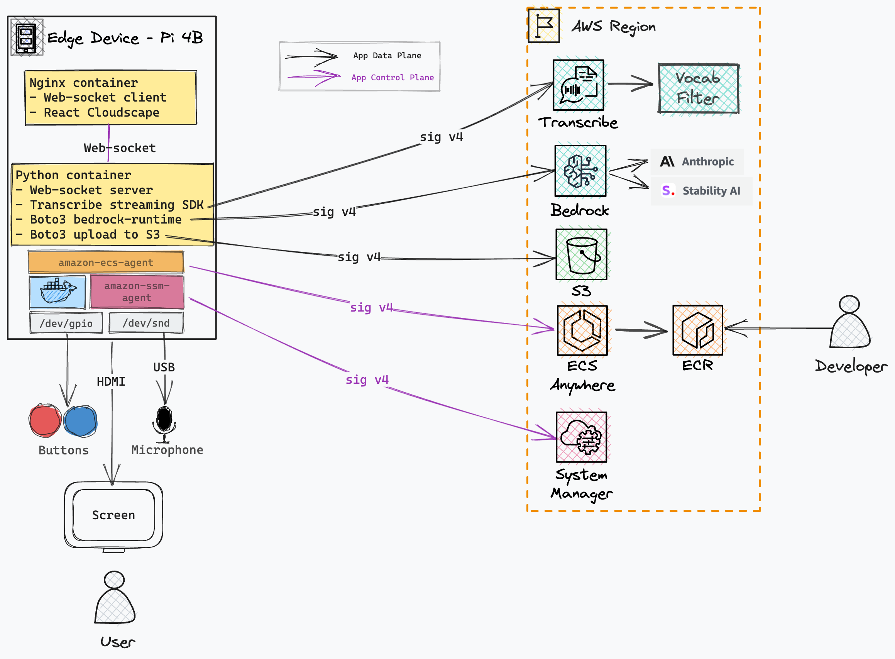

Amazon Bedrock AI Karaoke is an interactive demo of prompting foundation models with a microphone and asking a human to pick their preferred response.

### Architecure

Click [here](https://github.com/aws-samples/amazon-bedrock-ai-karaoke) to access the library and start designing your solution.