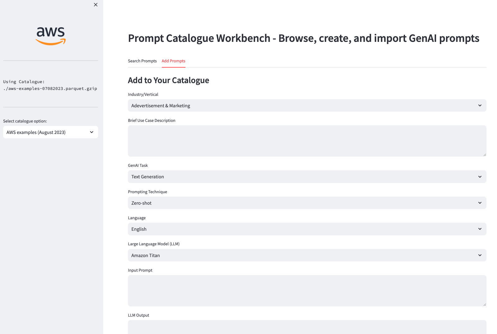

### Amazon Bedrock Prompting Examples & Tools
This repo has a set of prompt engineering examples and prompting tools for working with Amazon Bedrock.

### Content:

Notebooks with prompt examples per industry:
[Example notebooks](https://github.com/aws-samples/amazon-bedrock-prompting/blob/main/notebooks)

Notebooks with examples for prompt misuse mitigation and evaluation:
[Example notebooks](https://github.com/aws-samples/amazon-bedrock-prompting/blob/main/notebooks)

Useful tools for working with Generative AI prompts:
[Bedrock in Excel](https://github.com/aws-samples/amazon-bedrock-prompting/blob/main/bedrock-excel)

### Auto-Prompting assistant

### Prompt Examples Browser & Creator

[Keymaker - Prompt translation across LLMs made easy](https://github.com/aws-samples/amazon-bedrock-prompting/blob/main/keymaker)

Prompt templates for working Bedrock in LangChain

[Prompt Templates](https://github.com/aws-samples/amazon-bedrock-prompting/blob/main/prompt_templates)

Click [here](https://github.com/aws-samples/amazon-bedrock-ai-karaoke) to access the library and start designing your solution.