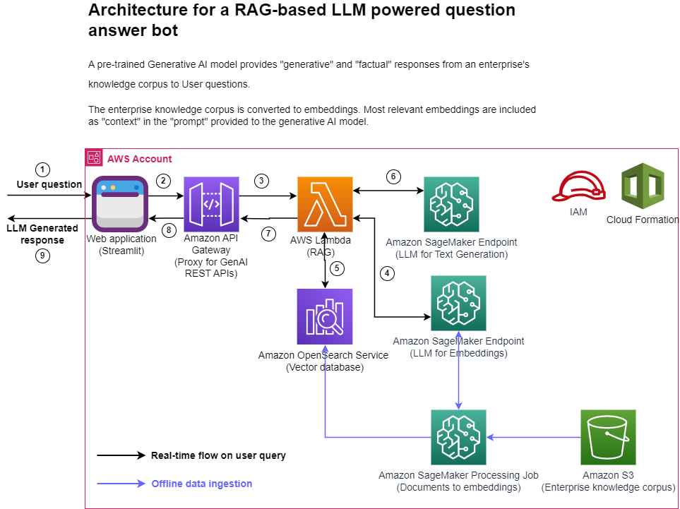

### Q&A with LLM and RAG:

A question answer task on a corpus of enterprise specific data is a common use-case in an enterprise scenario. If the data to be used for this task is publicly available then chances are that a pre-trained foundation large language model (LLM) will be able to provide a reasonable response to the question but this approach suffers from the following problems: 1/ the LLM is trained with a point in time snapshot of the data so its response will not be current, 2/ the LLM could hallucinate i.e. provide convincing looking responses that are factually incorrect and 3/ most importantly, the model may never have seen the enterprise specific data and is therefore not able to provide a useful response.

### Architecure

Click [here](https://github.com/aws-samples/llm-apps-workshop/tree/main/blogs/rag) to access the library and start designing your solution.