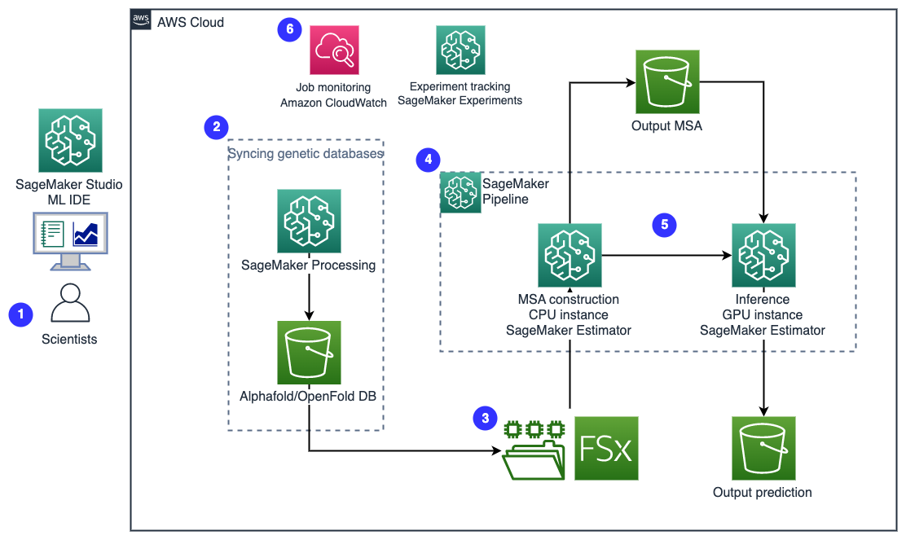

### Protein folding workflows to accelerate drug discovery on Amazon SageMaker:

Drug development is a complex and long process that involves screening thousands of drug candidates and using computational or experimental methods to evaluate leads. Drug discovery is the research component of this pipeline that generates candidate drugs with the highest likelihood of being effective with the least harm to patients. Machine learning (ML) methods can help identify suitable compounds at each stage in the drug discovery process, resulting in more streamlined drug prioritization and testing, saving billions in drug development costs.

Amazon SageMaker is a fully managed service to prepare, build, train, and deploy high-quality machine learning (ML) models quickly by bringing together a broad set of capabilities purpose-built for ML. It offers a fully-managed environment for ML, abstracting away the infrastructure, data management, and scalability requirements so users can focus on building, training, and testing ML models.

### Architecure

Click [here](https://github.com/aws-samples/amazon-sagemaker-protein-folding-workflows) to access the library and start designing your solution.