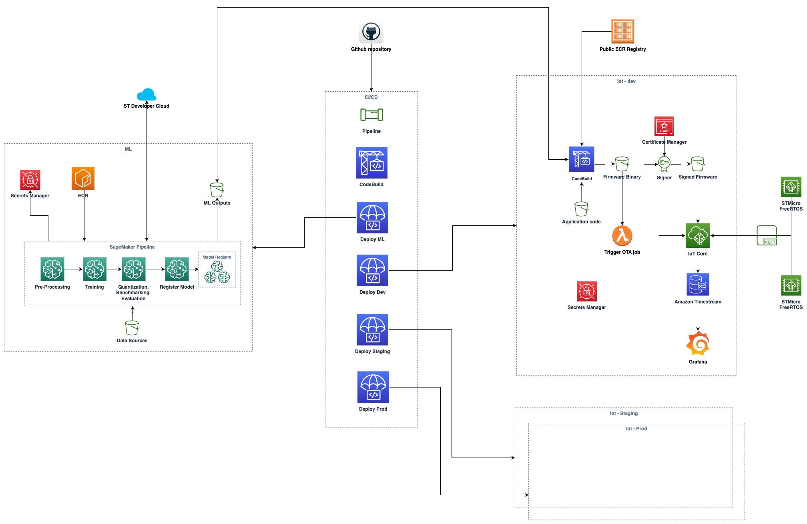

## AWS STM32 ML at Edge Accelerator

This is an AWS STM32 example project that implements MLOps infrastructure using SageMaker pipeline to train and generate an audio classification model that will run on edge devices (stm32u5 series) with OTA updates using Freertos. Devices are connected to Iot Core and data is collected via mqtt.

### Architecure

Click [here](https://github.com/aws-samples/aws-stm32-ml-at-edge-accelerator) to access the library and start designing your solution.