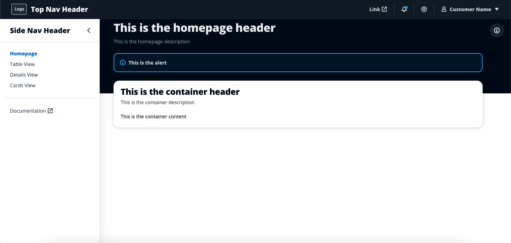
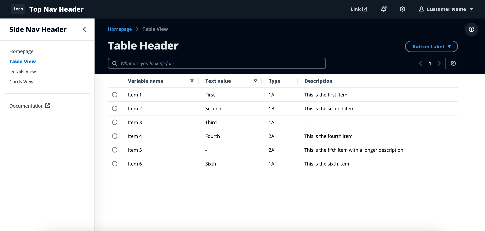
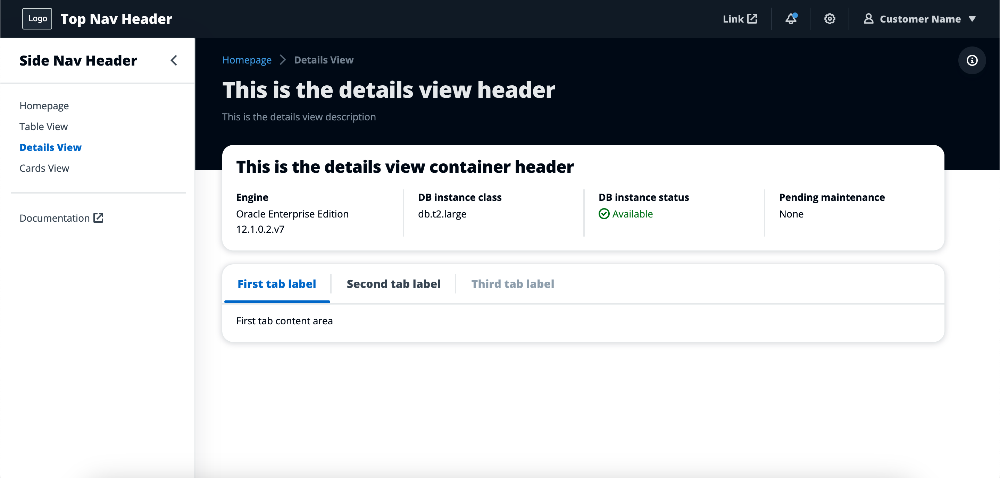
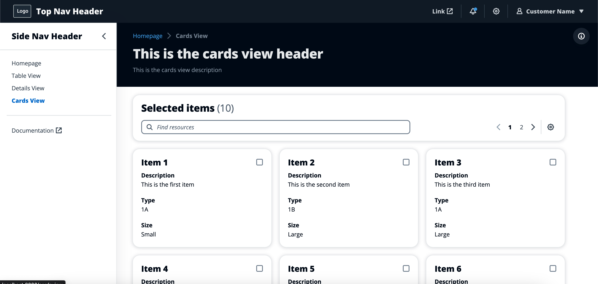

# WebUI Starter Kit

WebUI Starter Kit is a build asset for Solution Building Enablement. It provides modular templates with low-code, configurable files for building web applications connected to AWS services. It is a self-service tool intended to reduce development effort for partners and accelerate completion of the SBE Design & Build Phase.


## GitHub Repository
GitHub repo: Coming soon...
 
Live website example: [WebUI Starter Kit](https://shanjon.github.io/web-ui-starter-kit/)

## How it works

WebUI Starter Kit leverages the Cloudscape Design System and AWS APIs to generate pre-built, configurable templates for web applications. Users define the application’s structure by choosing from a set of page types (e.g., Homepage, Table view, Card view), and then Starter Kit generates a React application with the pages chosen. For each page, the Starter Kit generates an index file and a configuration file. The configuration file enables users with limited development experience to update static data (e.g., headers) and define API calls for sending and receiving dynamic application data (e.g., database query results). Because the templates are modular, users can include or omit page types according to the needs of the particular application.

Starter Kit's ready-made web applications provide clean and consistent branding across SBE solutions, and give clear, prescriptive guidance on how to start developing and delivering product-centric solutions to customers. Because each configuration file defines a clear set of parameters for customization, the templates are accessible for teams with varying levels of technical depth and require minimal time for onboarding and enablement.


## User flow

**1. User identifies the structure of app they want to build, for example:**
 
* Homepage
* Table View
* Details View

**2. Template is generated with 2 files for each page:**
 
* `Page.jsx` – contains layout and components for the page
* `page-config.jsx` – contains customizable configuration for `Page.jsx`

**3. User updates `page-config.jsx` with:**
 
* Static data (labels, headers, etc.)
```
<h1> Solution Name </h1>
```
* Props and attributes (select options, links, etc.)

```
export const PRICE_CLASS_OPTIONS = [

  { label: 'Use all locations', value: '0' },

  { label: 'Use only US, Canada, and Europe', value: '1' },

  { label: 'Use only US, Canada, Europe, and Asia', value: '2' }

];
```
 
* Dynamic data pulled via APIs

**4. User implements additional customizations as needed**

## Sample pages
### Homepage



### Table View



### Details View



### Cards View


