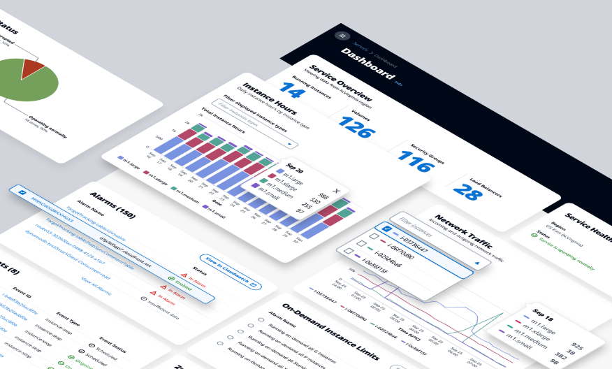
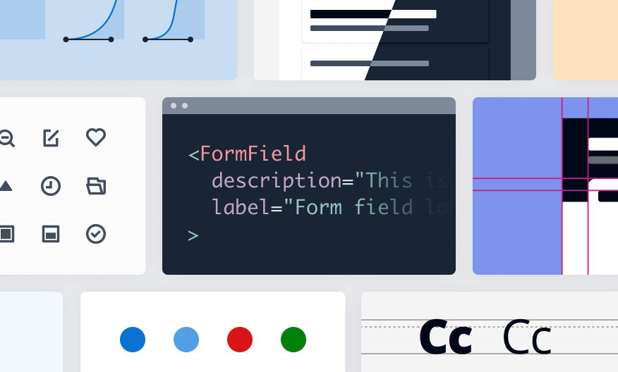
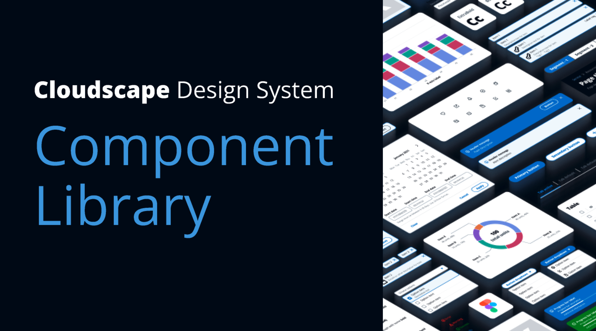

# Cloudscape Design System

Cloudscape offers user interface guidelines, front-end components, design resources, and development tools for building intuitive, engaging, and inclusive user experiences at scale.

## Meet Cloudscape

Cloudscape is an open source design system to create web applications. It was built for and is used by Amazon Web Services (AWS) products and services. We created it in 2016 to improve the user experience across web applications owned by AWS services, and also to help teams implement those applications faster. Since then, we have continued enhancing the system based on customer feedback and research. Learn more [about the system](https://cloudscape.design/about/).

## Get familiar with the system

Each [component](https://cloudscape.design/components/) has a playground where designers and developers can see how the component behaves, along with sample code. To save you time and effort when building, we offer extensive guidance on accessibility options and design solutions. Head over to our [demos](https://cloudscape.design/demos/) for examples of Cloudscape in action.

Click [here](https://cloudscape.design/) to see live demos, experiment with Cloudscape components, and learn more about the system.

## Cloudscape Figma Component Library

The Cloudscape Figma library consists of global styles and components that can be used to create your designs. The file can be used both as a sticker sheet (to copy and paste elements to your design files) and as a library (which you can publish to access all components from any design file).

This library enables you to design high-fidelity, interactive wireframes before investing time and resources into the graphical user interface for your solution. By producing wireframes prior to development, you can refine designs, conduct user testing, and validate user experience earlier on, accelerating development and reducing costs.

Click [here](https://www.figma.com/@cloudscape) to access the library and start designing your solution.