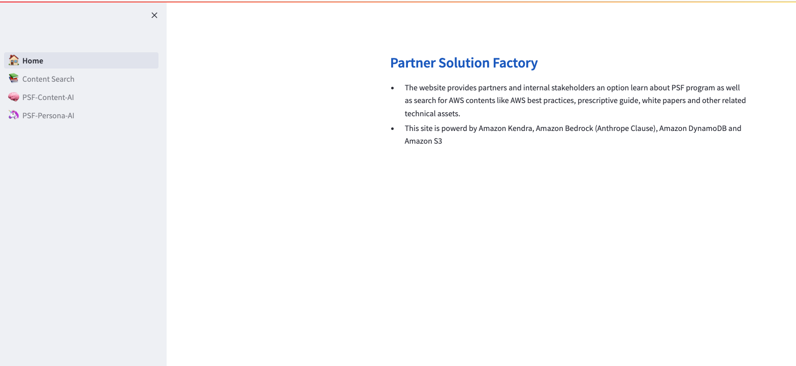
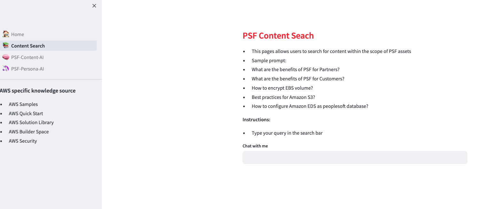

# Streamlit

Streamlit is an open source app framework for the Python programming language. It helps you create web apps for data science and machine learning in a short time and makes it easy to create and share beautiful web apps. It is compatible with major Python libraries such as scikit-learn, Keras, PyTorch, SymPy(latex), NumPy, pandas, Matplotlib, and more.

## Streamlit CLI
When you install Streamlit, a command-line interface (CLI) tool is installed as well. This tool allows you to run Streamlit apps, change Streamlit configuration options, and assists in diagnosing and fixing issues.

You can install streamlit using the following `pip` command:

```pip install streamlit```

### Streamlit Starter App
You can create an app with Streamlit in just a few steps:

1. Create a new Python script. Let's call it `home.py`.
2. Open `home.py` in your favorite IDE, then import these libraries (i.e., add the import statement)

    ```import streamlit as st```
    ```import pandas as pd```
    ```import numpy as np```

    ```st.title(This is my Home)```

3. Save the file and run using the following command from command line

    ```streamlit run home.py```

Here is a sample app mockup:



