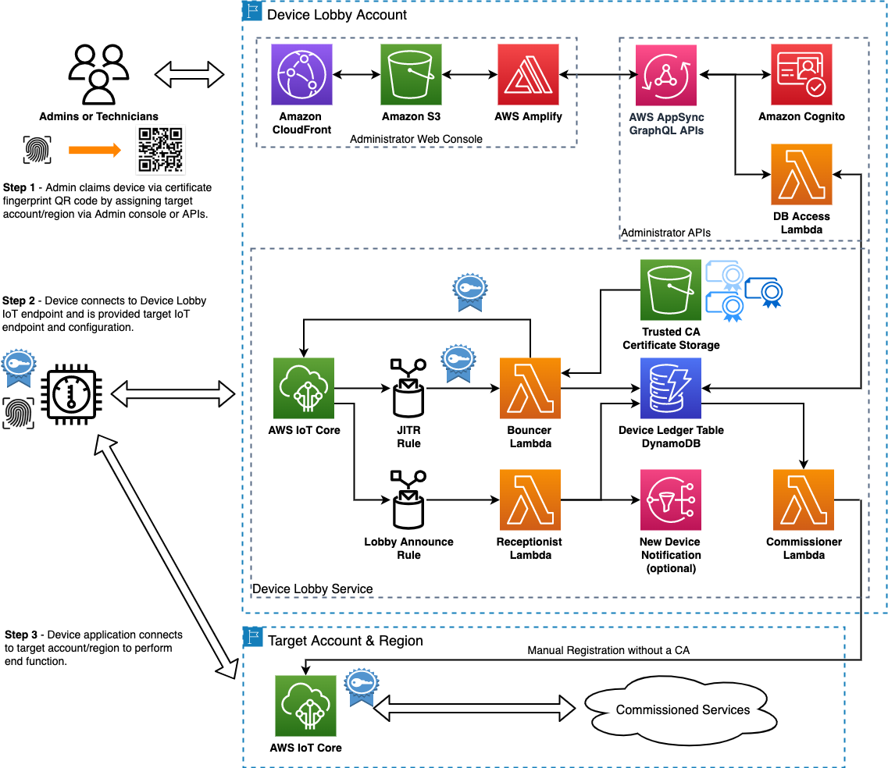

###  Introduction:
This solution provides a method for QR code onboarding of devices to AWS IoT Core. It simplifies the provisioning and onboarding process of devices by removing the requirement that an end cloud account/region is known at the time of device provisioning in the factory such as in the use case for a multi-tenant IoT deployment.

### Architecure

Click [here](https://github.com/aws-samples/aws-device-lobby) to access the library and start designing your solution.