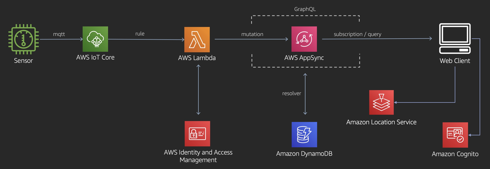

### Realtime IoT Dashboard with AWS AppSync and Amazon Location Service

###  Introduction:
This application demonstrates a web application dashboard receiving real-time updates from a series of IoT sensors. It depicts a fictitious set of pH sensors deployed around the San Francisco Bay. The solution is built with React, AWS AppSync, Amazon Location Service, AWS Amplify, and AWS IoT technologies.

### Architecure

Click [here](https://github.com/aws-samples/aws-appsync-iot-core-realtime-dashboard) to access the library and start designing your solution.