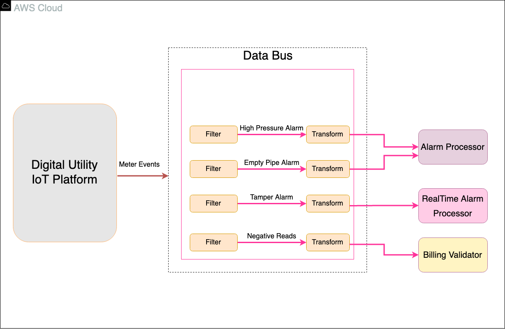
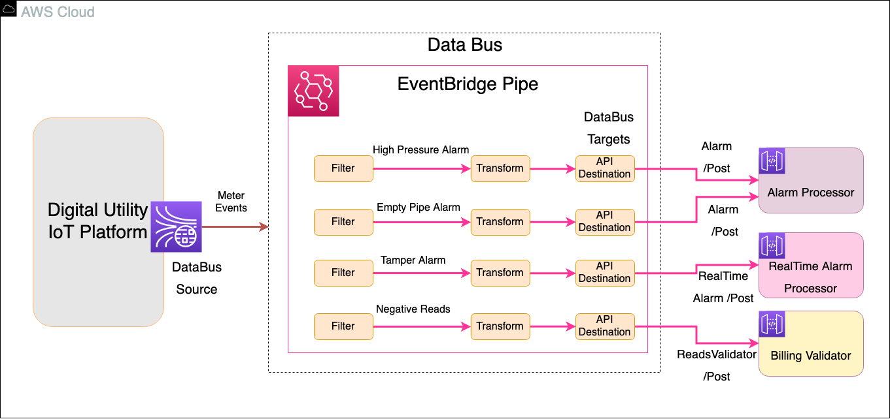

## Organizational Constraints and Concept of Solution -- Fanout

A water utility organization has built a Digital Utility IoT platform in
AWS cloud. The IoT platform process the telemetry data and generates
water meter events. The water meter events need to be acted up by
downstream services with different functional requirements and at a
different level of priorities. There are alarm events that needs to be
processed immediately, like tamper alarm in which the water meter wakes
up the communication module and reports the alarm in real-time. There
are non-real time alarms that needs to processed to for aggregation and
reporting purposes. Events like negative water meter reads needs to be
processed and validated by the billing services. There needs to be a
solution that filters the water meter events and applies transformation
for each type of events and integrates with its target service for
downstream processing of the meter events data.

### Business Architecture

Digital Utility IoT platform generates meter events. The meter events
are streamed in the real-time and these data streams acts as a data
source for the DataBus. The DataBus consumes the meter events and
filters the events separately for each event like High Pressure Alarm,
Empty Pipe Alarm, Tamper Alarm and Negative Water Meter Reads. The
filtered events are then applied with transformations independently. The
non-real-time events are gathered for the common target destination, the
Alarm Processor service. The Tamper Alarm events are sent to the Billing
Validator service after the transformation.

### Technology Architecture

**DataBus** -- EventBridge Pipes are implemented as the DataBus that
establishes a fan out from source to a single consumer integration for
sharing data between the data source and the data target.

**DataBus Source** -- The Digital Utility platform generates the meter
events and publishes to Kinesis Data Streams which is the data source
for the DataBus (EventBridge Pipe).

**DataBus Target** -- The filtered and transformed data are sent to the
API Destination which is the target of the DataBus. The API destination
initiates the API request to its respective target services for the
transformed events.

