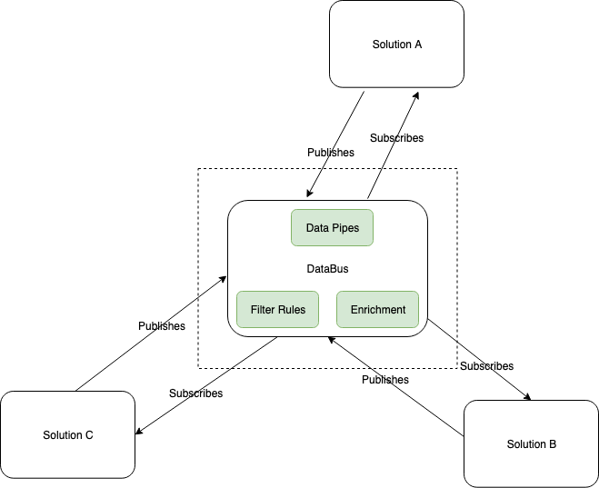
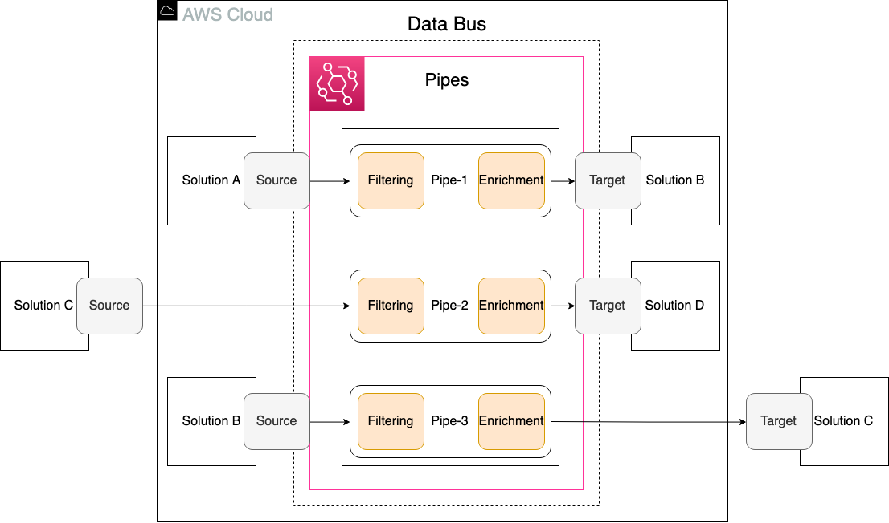
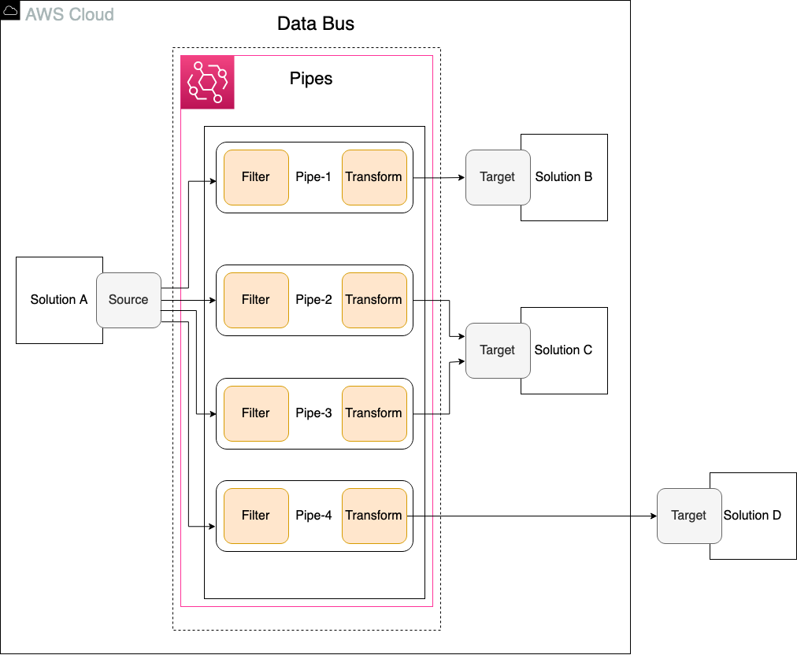

# Blueprint Overview

 

## Solution Overview

DataBus is an implementation guideline for solutions in which data are
shared by treating the data as events. The sharing mechanism is based on
the ability to observe events rather than being directed commands.

## Solution Definition

DataBus shares data asynchronously between the data producers and
consumers with an ability to share data to the predefined target
consumers by filtering the data based on rule definition. DataBus
supports the JSON format for data sharing. The DataBus attempts to retry
the data delivery if the target consumer service is down and can scale
horizontally to delivery millions of data events.

# Component diagrams

The following diagram explains the solution components in the DataBus
BP. Multiple solutions deployed in AWS cloud can either produce the data
or consume the data. The data pipes establish the data inbound paths
from the producer and the target destination path to the consumer based
on the configurations. A same solution/service can be a prosumer, that
is both producer and consumer. The filter rules determine the data
events that matches the criteria to be processed and sent to a
particular destination service/solution, thereby avoiding the additional
compute need for filtering the messages. The enrichment allows the
optional data enrichment from another AWS service. The DataBus also
supports the data transformation before sending the data to the
pre-defined target destination.

# Reference architecture diagrams:

## Point-to-Point Integration: 

Solutions A, B, D are deployed within AWS cloud and Solution C could run
outside AWS in a different cloud or on-premises. The following reference
architecture explains how DataBus architecture can be implemented to
achieve the consistent data sharing pattern between multiple solutions.

The DataBus pipes establishes point-to-point integration between data
producers and data consumers. The data source produces the data and that
can be filtered to match specific event to flow into the pipe. There is
an optional enrichment step that can be used to enrich or transform the
data before they reach the pre-defined targets. With DataBus, the
solution that produces data for one pipe could be a data consumer of
different pipe by implementing one of the supported target services in
the solution.

For the detailed implementation of the Point-to-Point integration with a
specific use case, please refer
[here](https://amazon.awsapps.com/workdocs/index.html#/document/be5de5ce57fef0fb1a8834088aa506f7a571f0365d8bfc1be6cff71c99ae1759).

Fanout From Single Data Source:

In this architecture, the Solution A that supports multiple consumers
acts as the data source and multiple EventBridge Pipes are created to
independently filter and transform the data. Each Pipe can have its own
target. Each Pipe is responsible for the transformations based on the
specific filter and the data is delivered to its own target. Multiple
Pipes can have a single target to achieve a scatter-gather pattern. In
this reference architecture, the data from the source Solution A is
scattered to Pipe-2 and Pipe-3 to apply different transformations before
the data is gathered in Solution C.

For the detailed implementation of the fanout pattern, with a specific
use case, please refer
[here](https://amazon.awsapps.com/workdocs/index.html#/document/ff9622ccbb1bf74445ef53d9ee7b5b537d64a4887759610e7a09c4e00083ff77).

# Research Methodology:

The DataBus BP is implemented using EventBridge Pipes that supports
point-to-point integration. The DataBus can also be used to support
multiple consumers for the same event stream. DataBus can be used for
use cases that needs a fanout of events from a single source to multiple
consumers. In fan out pattern, the DataBus bridges the single data
source with multiple consumers by creating multiple pipes that can
transform and enrich data without need for additional compute services.

EventBridge Pipes supports batching from the source and to the targets
that support it. Every event or batch of events received by the pipe
that travel to an enrichment or target is a pipe execution. There can be
up to 1000 pipes per account and region. All pipes in an account and
region are limited to 1000 concurrent executions. Pipe executions are
limited to a maximum of 5 minutes including the enrichment and target
processing.

EventBridge Pipes support optional input transformation when passing
data to the enrichment and the target. The enrichment can be used to
meet the needs of target service data requirements.

#### Supported Sources:

1.  Amazon DynamoDB stream.

2.  Amazon Kinesis stream.

3.  Amazon MQ broker.

4.  Amazon MSK stream.

5.  Self-managed Apache Kafka stream.

6.  Amazon SQS queue.

For complete and updated list, please check the
[documentation](https://docs.aws.amazon.com/eventbridge/latest/userguide/eb-pipes-event-source.html).

#### Supported Targets:

1.  API destination

2.  API Gateway

3.  Batch job queue

4.  CloudWatch log group

5.  ECS task

6.  Event bus in the same account and Region

7.  Firehose delivery stream

8.  Inspector assessment template

9.  Kinesis stream

10. Lambda function (SYNC or ASYNC)

11. Redshift cluster data API queries

12. SageMaker Pipeline

13. SNS topic

14. SQS queue

15. Step Functions state machine

i.  Express workflows (SYNC or ASYNC)

ii. Standard workflows (ASYNC)

For complete and updated list, please check the
[documentation.](https://docs.aws.amazon.com/eventbridge/latest/userguide/eb-pipes-event-target.html)