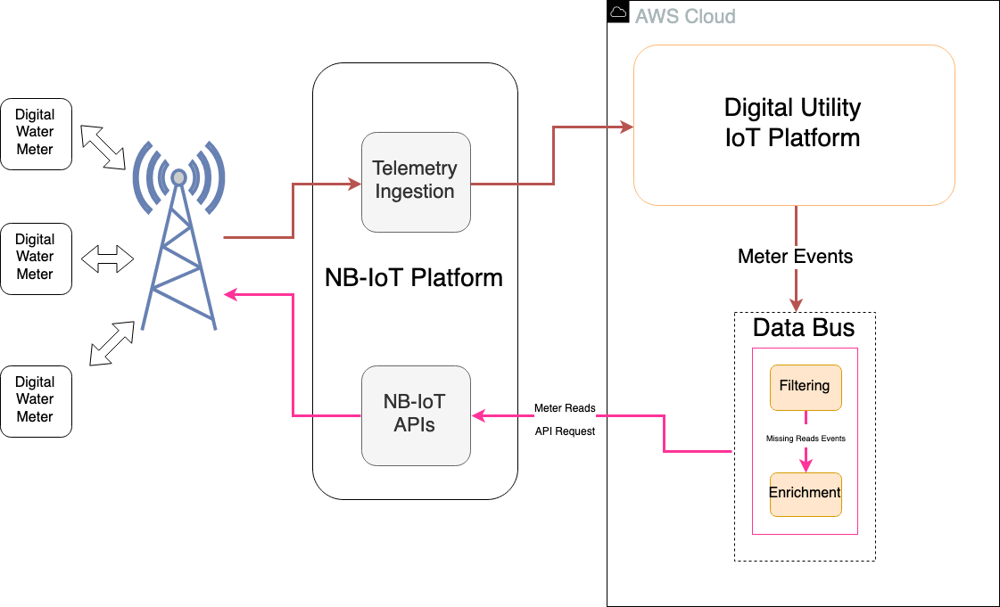
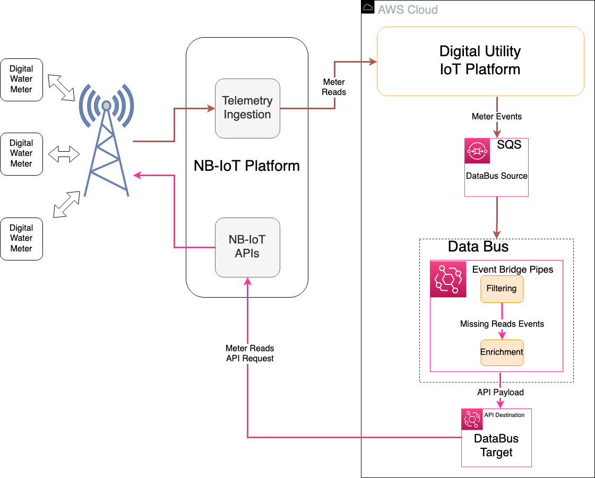
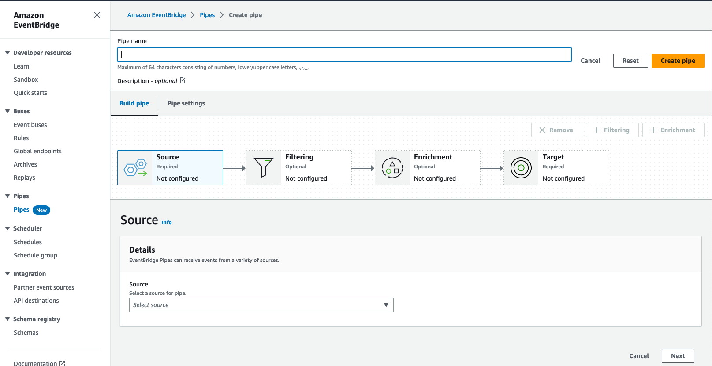
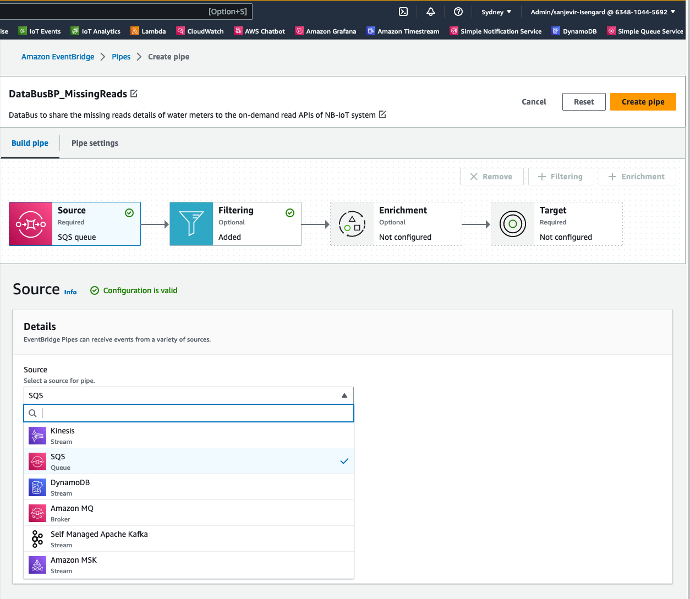
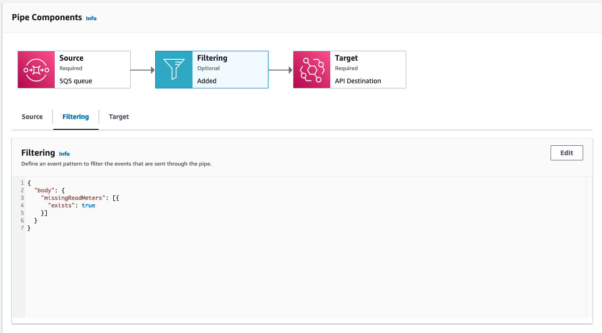
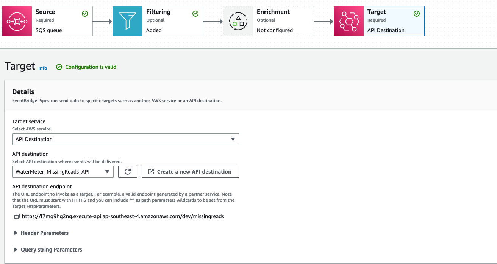
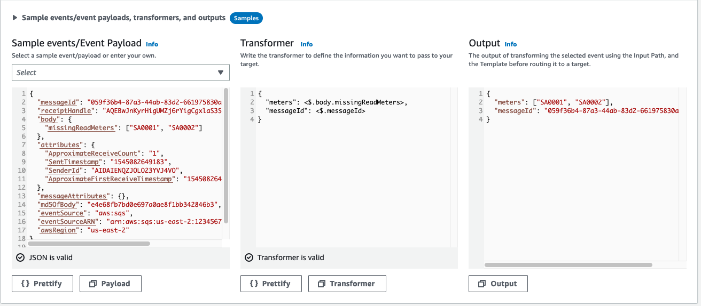

## Organizational Constraints and Concept of Solution 

A water utility organization has built a Digital Utility IoT platform in
AWS cloud. The water meters are managed by a Telco provided NB-IoT
platform that is built in the Telco's private cloud. The Digital Utility
IoT platform running in AWS cloud receives the water meter reads data
through the telemetry data ingestion from the NB-IoT platform. The
Digital Utility IoT platform process the data and derives insights and
generates Meter Events based on the processed meter data. One of such
meter events is, 'missing reads' where one or few of meters has failed
to report the water meter reads for that day. For this use case, the
NB-IoT platform has an on-demand read APIs where the cloud platforms can
initiate an API request get the water meter reads for specific set of
meters for the specified date range. The Digital utility IoT platform
should extend the solution by building a scalable service that can
identify the missing read events, create the API request payload and
initiate the API request to the NB-IoT platform.

### 

### Business Architecture

Digital Utility produces meter events and publishes to the meter events
queue. The DataBus takes the meter events queue as the data source and
applies filtering rules to filter only the 'missing reads' events. The
missing reads event data JSON is transformed into the payload format of
the on-demand read API of the NB-IoT platform. The DataBus is configured
with the API destination to target the API URL of NB-IoT platform.

### 

### Technology Architecture

**DataBus** -- EventBridge Pipes are implemented as the DataBus that
establishes a point-to-point integration for sharing data between the
data source and the data target.

**DataBus Source** -- The Digital Utility platform generates the meter
events and publishes to SQS which is the data source for the DataBus
(EventBridge Pipe).

**DataBus Target** -- The filtered and transformed data are sent to the
API Destination which is the target of the DataBus. The API destination
initiates the API request for the on-demand meter read API in the NB-IoT
platform.

# Implementation considerations

Deployment options

The DataBus BP can be implemented by following the step-by-step
deployment instruction in this section.

Before you deploy, review the cost, architecture, security, and other
considerations discussed in this guide. Follow the step-by-step
instructions in this section to configure and deploy into your account.

***Prerequisites***

The source and target for the DataBus has to be created before
proceeding with the DataBus implementation.

***Deployment Overview***

The deployment creates the DataBus component, that is EventBridge Pipe
and configures the source and target for the point-to-point integration.

**AWS CloudFormation template (outputs)**

NA 

Deployment Instructions

Go to EventBridge console and create a new EventBridge Pipe.

 

Select the DataBus source. In this implementation, the SQS is chosen as
source.

Add the filtering as per the solution need. In this implementation, the
meter events messages from SQS are filtered to process only the missing
read meter events.

Add the optional Enrichment if required. In this implementation, the
enrichment is not required. Proceed to creating the Target. This
implementation has API destination as a target, which is configured with
a connection to NB-IoT platform APIs.

# 

Add the transformer to convert the incoming message and verify whether
the output is in the required format for the target. In this
implementation, the meter IDs are filtered form the incoming message
along with the unique message ID and a new JSON object with required
keys are created as a payload body to the NB-IoT platform API.

Complete the EventBridge Pipe creation and test the end-to-to
functionality to confirm the point-to-point integration between the
DataBus source and the DataBus target are working fine as expected.
