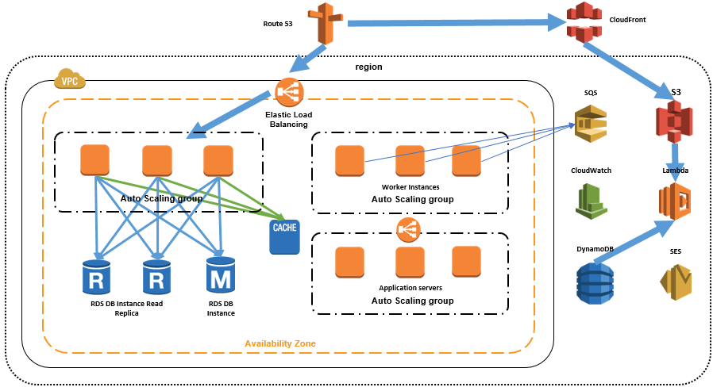

The [AWS Serverless](https://aws.amazon.com/serverless/) platform allows you to scale very quickly in response to demand. Below is an example of a serverless design that is fully synchronous throughout the application. During periods of extremely high demand, [Amazon API Gateway](https://aws.amazon.com/api-gateway/) and [AWS Lambda](https://aws.amazon.com/lambda/) will scale in response to your incoming load. This design places extremely high load on your backend relational database because Lambda can easily scale from thousands to tens of thousands of concurrent requests.

Consider decoupling your architecture and moving to an asynchronous model. In this architecture, you use an intermediary service to buffer incoming requests, such as [Amazon Kinesis](https://docs.aws.amazon.com/lambda/latest/dg/with-kinesis-example.html) or [Amazon Simple Queue Service](https://docs.aws.amazon.com/lambda/latest/dg/with-sqs-example.html) (SQS). You can configure Kinesis or SQS as out of the box event sources for Lambda. In design below, AWS will automatically poll your Kinesis stream or SQS resource for new records and deliver them to your Lambda functions. You can control the batch size per delivery and further place throttles on a [per Lambda function basis](https://aws.amazon.com/about-aws/whats-new/2017/11/set-concurrency-limits-on-individual-aws-lambda-functions/).

## Auto Scaling

After you shift workload components to the appropriate AWS services and decouple your application, you can introduce Auto Scaling to squeeze more efficiency out of your infrastructure. _\<link to reference doc\>_

Reference architecture diagrams:

The reference diagram below illustrates setting up EC2 auto scaling instances

