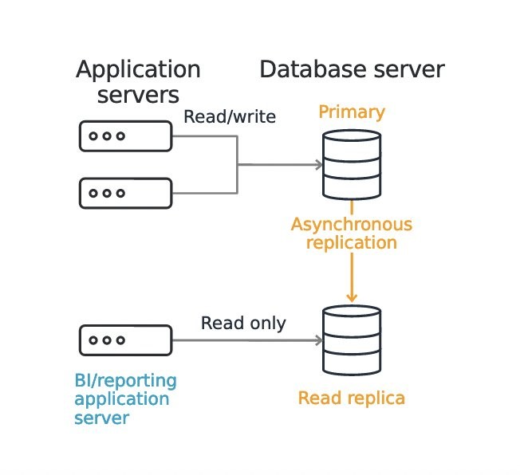
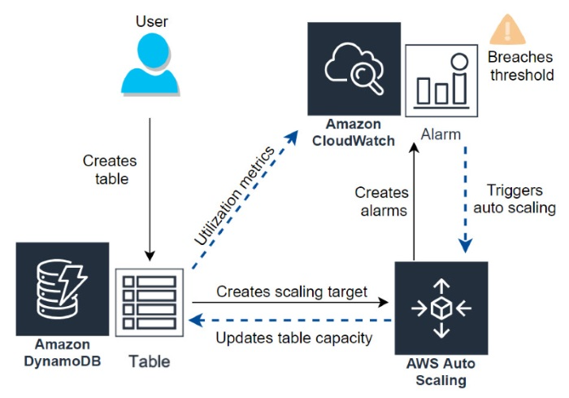

**Vertical scaling**

Vertical scaling is the most straightforward approach to adding more capacity in your database. Vertical scaling is suitable if you can't change your application and database connectivity configuration. You can vertically scale up your RDS instance with a click of a button. Several [instance sizes](https://aws.amazon.com/rds/instance-types/) are available, from general purpose to CPU and memory optimized, when resizing in [Amazon RDS for MySQL](https://aws.amazon.com/rds/mysql/), [Amazon RDS for PostgreSQL](https://aws.amazon.com/rds/postgresql/), [Amazon RDS for Maria DB](https://aws.amazon.com/rds/mariadb/), [Amazon RDS for Oracle](https://aws.amazon.com/rds/oracle/), or [Amazon RDS for SQL Server](https://aws.amazon.com/rds/sqlserver/). Instance types have combinations of CPU, memory, storage, and networking capacity, and give you the flexibility to choose the appropriate mix of resources for your database. In addition, each instance type includes several instance sizes, which allows you to scale your database to the requirements of your target workload.

**Horizontal scaling**

Horizontal scaling increases performance by extending the database operations to additional nodes. You can choose this option if you need to scale beyond the capacity of a single DB instance. An advantage of horizontally scaling in Amazon RDS is that AWS handles the infrastructure management, provisioning, and configuration of additional nodes. You can easily create additional nodes from the Amazon RDS console or API.

To scale your read operations, you horizontally scale your database through read replicas. When you create a read replica, Amazon RDS creates read-only copies of your database and manages the asynchronous replication from the primary database. Amazon RDS DB engines such as MySQL, MariaDB, Oracle, PostgreSQL, and SQL Server all have the read replica feature.

You can use read replicas to increase performance for read options, for example redirecting the read traffic for business reporting and read queries from applications. Another use case is for disaster recovery—you can promote the read replica to the primary database if it becomes unavailable. However, it's important to note that read replicas are not a replacement for the high availability and automatic failover capabilities that Multi-AZ provides.

**Amazon RDS**

Add redundancy by using the multi-AZ feature of RDS.When you use Multi-AZ, RDS will create a standby database instance in a different AZ and replicate data to it synchronously. This synchronous data replication makes your failover experience seamless.

You can scale the database tier with [Amazon RDS Read Replicas](https://aws.amazon.com/rds/details/read-replicas/). Read Replicas are available if you are using MySQL, PostgresSQL, or Amazon Aurora. RDS MySQL and RDS PostgresSQL allow up to five Read Replicas and leverage native replication capability of MySQL and PostgresSQL that are subject to replication lag

**Amazon Aurora** / **Amazon Document DB**

Allows up to 15 Replicas and experiences minimal replication lag because Aurora Replicas use the same underlying storage

Aurora Auto Scaling dynamically adjusts the number of Aurora Replicas provisioned for an Aurora DB cluster using single-master replication. Aurora Auto Scaling is available for both Aurora MySQL and Aurora PostgreSQL. Aurora Auto Scaling enables your Aurora DB cluster to handle sudden increases in connectivity or workload. When the connectivity or workload decreases, Aurora Auto Scaling removes unnecessary Aurora Replicas so that you don't pay for unused provisioned DB instances.

You define and apply a scaling policy to an Aurora DB cluster. The _scaling policy_ defines the minimum and maximum number of Aurora Replicas that Aurora Auto Scaling can manage. Based on the policy, Aurora Auto Scaling adjusts the number of Aurora Replicas up or down in response to actual workloads, determined by using Amazon CloudWatch metrics and target values.

You can use the AWS Management Console to apply a scaling policy based on a predefined metric. Alternatively, you can use either the AWS CLI or Aurora Auto Scaling API to apply a scaling policy based on a predefined or custom metric.

## **DynamoDB auto scaling**

When you create a DynamoDB table, auto scaling is the default capacity setting, but you can also [enable auto scaling](https://docs.aws.amazon.com/amazondynamodb/latest/developerguide/AutoScaling.Console.html#AutoScaling.Console.ExistingTable) on any table that does not have it active. Behind the scenes, as illustrated in the following diagram, DynamoDB auto scaling uses a [scaling policy](https://docs.aws.amazon.com/autoscaling/application/userguide/application-auto-scaling-target-tracking.html) in [Application Auto Scaling](https://docs.aws.amazon.com/autoscaling/application/userguide/what-is-application-auto-scaling.html). To configure auto scaling in DynamoDB, you set the minimum and maximum levels of read and write capacity in addition to the target utilization percentage. Auto scaling uses [Amazon CloudWatch](https://aws.amazon.com/cloudwatch/) to monitor a table's [read and write capacity metrics](https://docs.aws.amazon.com/amazondynamodb/latest/developerguide/metrics-dimensions.html). To do so, it creates [CloudWatch alarms](https://docs.aws.amazon.com/AmazonCloudWatch/latest/monitoring/AlarmThatSendsEmail.html) that track consumed capacity.

**NoSQL databases**

Horizontal Scaling - The real advantage of NoSQL is horizontal scaling, aka shading. Considering NoSQL 'documents' are sort of a 'self-contained' object, objects can be on different servers without worrying about joining rows from multiple servers, as is the case with the relational model.