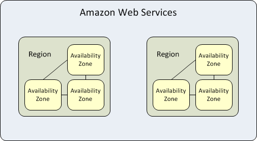

# Scalability Blueprint

_Scalability is the ability for systems – such as applications, storage, databases and networking – to continue to function properly when changed in size or volume or number of concurrent users. It often refers to increasing or decreasing resources as needed to meet the higher or lower demands of a business._

## Component diagrams

**Global Infrastructure** includes regions and Availability Zones that should be considered as part of the services selection. This global footprint gives you the ability to deploy near your customers and migrate your workload as needed.

Choose regions based on several criteria:

1. Proximity to end user
2. Data regulatory requirements
3. Expansion strategy
4. Cost
5. Service availability

**Horizontal scaling** at the application layer, database layer, DB Read Replicas will allow system to scale pretty far. But for serving over ten thousand users, we highly recommend decouple the architecture.

The AWS platform offers services in many flavors so that you can provision just enough performance, availability, and durability depending on your requirements. Your ability to be aware and leverage the entire palette of AWS services will be key to adding scalability to your application.