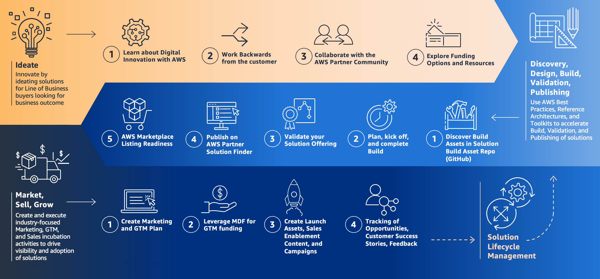
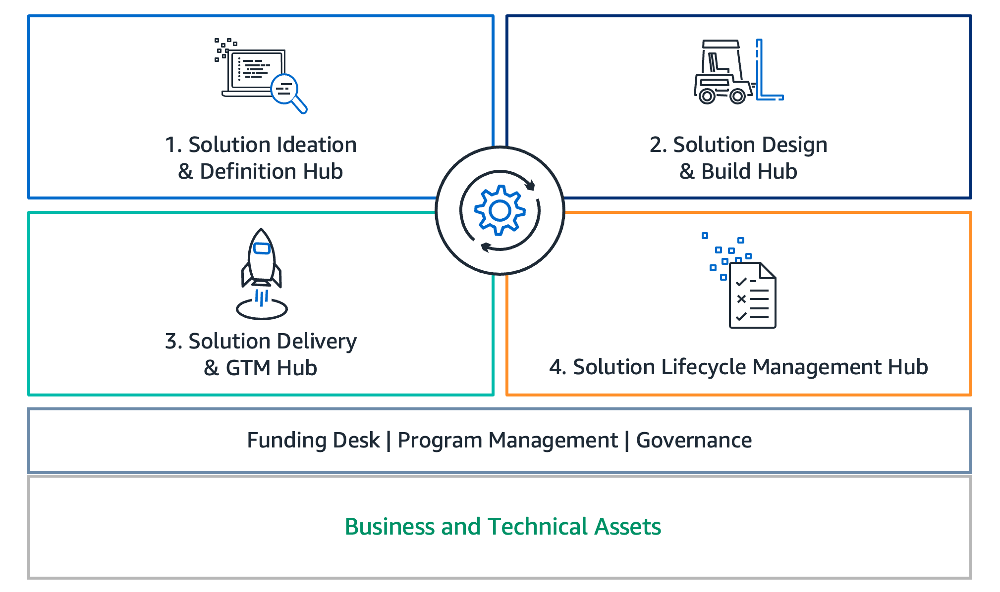

# Solution Building Asset Repository
Welcome to the Solution Building Asset Repository! The Solution Building Asset Repository is a curated collection of technical resources for building solutions that meet the Solution Building Enablement quality bar. It includes general and industry-specific assets, accelerators, blueprints, solution guidance, and reference architectures to help you work through the Solution Building Enablement phases of solution development - [learn more about each of these assets here](glossary.md).

Learn more about Solution Building Enablement (SBE) and the phases of SBE solution development below.

## Solution Building Enablement
[Solution Building Enablement](https://partnercentral.awspartner.com/partnercentral2/s/guides) is designed to help all AWS Partners build and deliver solutions that address both current and future business outcome needs for customers. It simplifies and expedites delivery of industry-focused solutions on AWS as we continue to see a shift toward business outcome solutions driven by line of business buyers, with customers more likely to purchase solutions with business outcomes that impacts their top-line.

Our guidance is designed to help accelerate your solution building on AWS, starting with solution innovation and funding options, build assets that support discovery, design, build, and validation, all the way to publishing, go-to-market, and solution lifecycle management. This includes custom resources, such as templates and workshops, to help you document and operationalize the guidance that applies to you as part of your own organization’s solution building on AWS.

Solution Building Enablement is made up of four phases of solution development. These include Ideation, Design & Build, GTM & Sales, and Solution Lifecycle Management:

The Solution Building Asset Repository supports the Design & Build phase by providing technical resources to minimize effort and time spent design and building a solution. The Design & Build phase includes Design, Build, Validation, and Publishing.

#### Design
The Design phase is structured around translating the high-level customer and solution information into more tactical design decisions and documentation. The goal is to take the human-centered insights from the Ideate phase and transform them into an actionable design artifacts that guide the engineering build-out. It is expected that some elements of the architecture may change based on testing, but this establishing an initial technical strategy is crucial to providing a solid foundation for the development team to work from.

Resources for supporting the Design phase, including reference architectures, UX design systems, and more are available in the Solution Building Asset Repository under Horizontal Technologies and Industries.

#### Build
The goal of the Build phase is to take the design established during the Design phase and transform it into working software leveraging robust engineering principles, testing, and automation to deliver a high-quality solution. The output is a tested, documented, production-ready initial release providing core value to users.

Resources for supporting the Build phase, including assets, accelerators, blueprints and more are available in the Solution Building Asset Repository under Horizontal Technologies, Industries, and Tools.

#### Validation
Validating your [hardware](https://aws.amazon.com/partners/programs/dqp/), [software, or services](https://aws.amazon.com/partners/foundational-technical-review/) offering as an AWS Partner is an important factor in ensuring that a solution and its components meet a quality bar that delivers a consistent customer experience. It also enables additional benefits such as co-sell opportunities, funding options, and automatic listing in AWS Partner Solution Finder. Completion of validations also supports [your journey](https://aws.amazon.com/partners/paths/) in the AWS Partner Network. 

#### Publishing
[AWS Partner Solutions Finder](https://aws.amazon.com/partners/psf-faq/) provides AWS customers with a centralized place to search, discover, and connect with trusted AWS Partners based on customers’ business needs. Customers can use the AWS Partner Solutions Finder to find partners and their validated offerings spanning from hardware, software, to services. Customers can l also look for partners based on a variety of criteria including industry, use case, location, and product areas. 

[AWS Marketplace](https://aws.amazon.com/mp/marketplace-service/overview) allows customers to find third-party software, data, and services that run on AWS and manage from a centralized location. AWS Marketplace includes thousands of software listings and simplifies software licensing and procurement with flexible pricing options and multiple deployment methods. AWS Marketplace allows Independent Software Vendors (ISVs), Data Providers, and Consulting Partners [can sell their software, services, and data](https://aws.amazon.com/marketplace/partners/management-tour) in AWS Marketplace to anyone with an AWS account can use. Jointly with the AWS Partner Network, AWS Marketplace helps ISVs and Consulting Partners to build, market, and sell their AWS offerings by providing valuable business, technical, and marketing support.