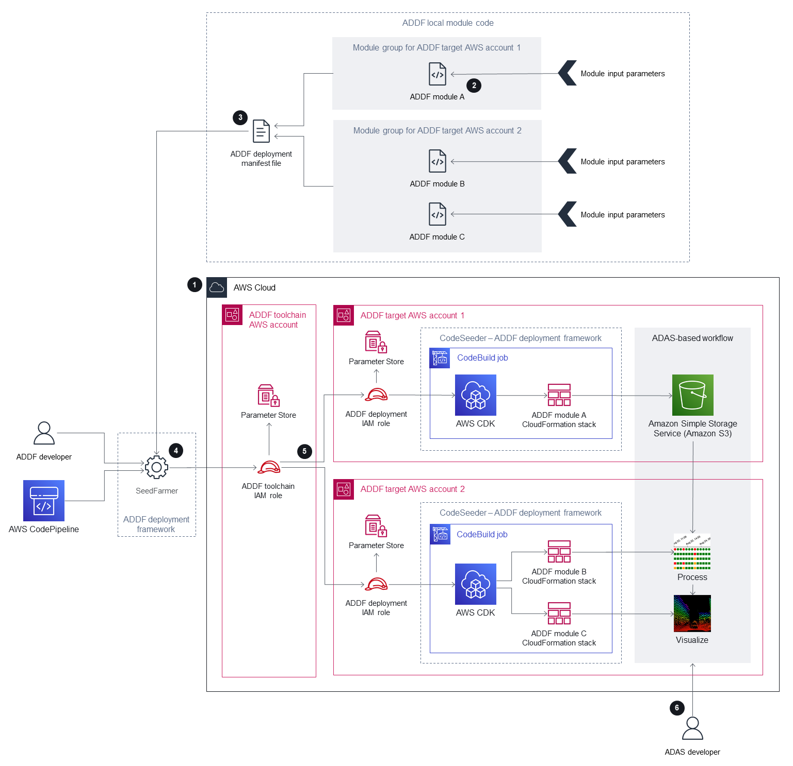

# Autonomous Driving Data Framework (ADDF)

The ***Autonomous Driving Data Framework (ADDF)*** is a comprehensive and open-source solution designed to provide modular code artifacts for automotive teams seeking to implement common  tasks for advanced driver-assistance systems (ADAS).

ADDF offers solutions for tasks like configuring centralized data storage, data processing pipelines, visualization mechanisms, search interfaces, simulation workloads, analytics interfaces, and prebuilt dashboards. Users can easily leverage, customize, or create modules to streamline deployment efforts.

Architecture: 

## How to use
Source code : [GitHub](https://github.com/awslabs/autonomous-driving-data-framework/blob/main/docs/deployment_guide.md)

Documentation: [PDF](chrome-extension://efaidnbmnnnibpcajpcglclefindmkaj/https://docs.aws.amazon.com/pdfs/prescriptive-guidance/latest/addf-security-and-operations/addf-security-and-operations.pdf)
