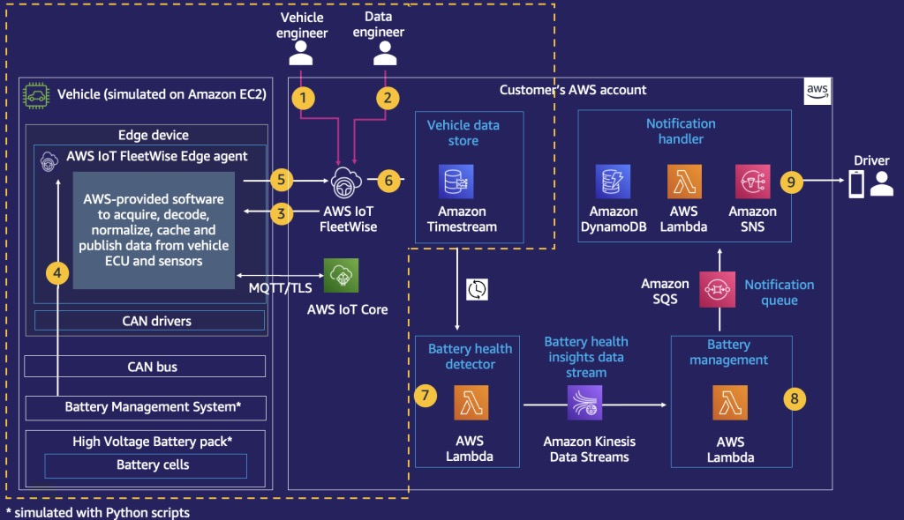
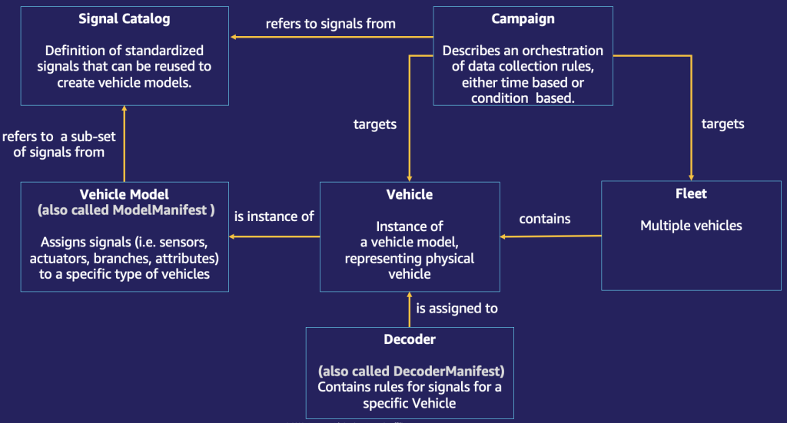

# Building an Electric Vehicle Battery Monitoring Solution with AWS IoT FleetWise

This solution makes it easier for automakers to collect, transform, and transfer vehicle data to the cloud specially for EV batteries. Once transferred, you can use the breadth and depth of AWS analytics and machine learning services to extract value from the vehicle data. If you have no previous experience with AWS IoT FleetWise, please consider starting with the blog [Generating insights from vehicle data with AWS IoT FleetWise](https://aws.amazon.com/blogs/iot/generating-insights-from-vehicle-data-with-aws-iot-fleetwise/). You will learn about use cases, technical capabilities, and a logical architecture for AWS IoT FleetWise. In the same blog, an Electric Vehicle (EV) battery monitoring solution is introduced.

## Use Cases for Near-Real Time Vehicle Data Processing

- **Vehicle Issue Prevention**: Real-time vehicle data enables automakers and fleet operators to enhance driving experiences and improve vehicle quality. For instance, monitoring electric vehicle battery temperature helps detect rate of discharge, better route energy planning, fixing issues such as overheating, enabling quick analysis and root cause assessment, leading to immediate corrective actions.

- **Optimization Loop for Advanced Driver Assistance Systems (ADAS)**: ADAS systems require continuous optimization and retraining of machine learning models. Access to real-time vehicle data enables this optimization process, reducing unknowns and enhancing safety.

*For the most up-to-date information and resources, please refer to [AWS IoT FleetWise Documentation](https://docs.aws.amazon.com/iot-fleetwise/latest/developerguide/what-is-fleetwise.html).*

## Use Case

Lithium-ion batteries (Li-ion) are widely used as energy storage systems for EVs. When operating EV fleets, continuous monitoring and protection of battery cells is an important consideration.

For EV manufacturers and fleet operators, the ability to detect and predict battery performance and issues such as overcurrent, overcharge, or overheating is crucial. This can improve the efficiency and safety of fleet operations by enabling timely planning for battery replacement. It also allows EV manufacturers to collaborate with battery suppliers on battery improvement initiatives by evaluating the conditions of the battery in different scenarios.

The purpose of this accelerator is to assiss you get up and running with EV telematics jurney and will help you on how you can use AWS IoT FleetWise to collect and transfer Battery Management System (BMS) parameters to the cloud. For this purpose, we will use an example of overcurrent detection use-case. After the data is transferred, it will be stored in a database, ready to be used for monitoring, alarming, and ML model training.

## Solution Architecture

The following diagram shows the architecture of the solution

The following diagram shows the logical data flow of the solution

## How to use

Source code: [GitHub](https://github.com/aws-samples/aws-iot-fleetwise-evbatterymonitoring)

Blogs: [Part 1](https://aws.amazon.com/blogs/iot/generating-insights-from-vehicle-data-with-aws-iot-fleetwise-part1/), [Part 2](https://aws.amazon.com/blogs/iot/building-an-ev-battery-monitoring-solution-with-aws-iot-fleetwise-part-1-2/)

