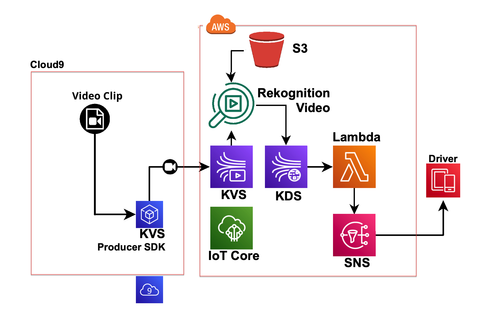

# Cloud-Based Driver Monitoring System (DMS)

In response to the growing concern over driver drowsiness and distraction, many countries mandated that vehicles sold within their jurisdiction must be equipped with Driver Monitoring Systems (DMS). To advance the development of cloud-based DMS solutions, a workshop has been organized that will introduce a reference solution cloud architecture and utilize Amazon Web Services (AWS).

## Workshop Highlights

- This workshop utilizes Amazon Kinesis Video Streams, enabling the building of low-latency video solutions for various applications, including smart surveillance cameras, robotics applications, and connected vehicles.

- **Key Learning Objectives**:
  - Live face recognition.
  - Near real-time analysis using Amazon Rekognition Video.
  - Integration of connected cameras into AWS IoT service.

- **Workflow Overview**: In the workshop, a virtual camera mounted in the car's cabin records live video of both the driver (DMS) and passengers (OMS). This video feed is transmitted in real-time to a Kinesis Video Stream. The Rekognition service actively processes the video stream to identify faces, including that of the driver, and provides associated confidence scores. Additionally, it analyzes pitch, yaw, and roll angles to gauge the driver's attentiveness to the road (Gaze). In the event signs of drowsiness are detected, an alert is immediately activated, prompting the driver to consider taking a break or safely pulling over.

- **Architecture**: The workshop's architecture focuses on using Kinesis Video Stream and Rekognition to enhance driver safety by monitoring attention levels and detecting signs of drowsiness in real-time. In real deployments, an edge ML solution can handle immediate ML, and video streams are sent to AWS for verification and compliance.

## Workshop Environment

- **Cloud 9 Simulation**: The workshop simulates a camera in a Cloud9 environment, sending data upstream to AWS cloud.

- **Practical applications**: A streamer is loaded onto a single-board computer, capable of transmitting video, such as a Raspberry Pi with an Intel RealSense camera.

## Key Takeaways

- Set up your AWS Cloud9 environment to upload video to Amazon Kinesis Video Streams.
- Install the Amazon Kinesis Video Streams Producer SDK and run a sample app.
- Utilize the AWS management console for video analysis.

## How to use
Workshop and source code link: [DMS Workshop](https://catalog.us-east-1.prod.workshops.aws/workshops/0b62e251-40ae-46ec-a264-52a6a451ee12/en-US)

