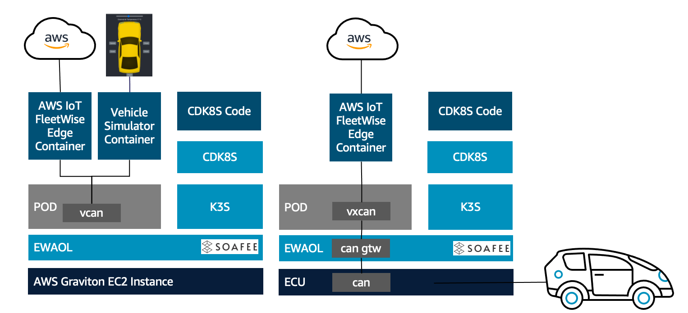

## Overview of a Big Loop

This asset contains instructions and code to create environmental parity between a virtual ECU (on EC2) and an actual ECU (ARM Processor Platform) It deploys AWS IoT FleetWise edge on EWAOL it guides you through the process of running the AWS IoT FleetWise Edge on the Edge Workload Abstraction and Orchestration Layer (EWAOL) using containerization and orchestration with k3s. 

Containers are great! you can easily move them between cloud and physical environments, (provided you are usibng ARM v8 cores). 
Aside from containers you need an orchestrator, here we used cdk8s framework to streamline development, you can easily replace it with other orchestrators of your liking. 

- Detailed set of instructions to get started. please use Cloud9 environment in one of the supported regions.
- The CloudFormation stack is provided, which takes approximately 3 minutes.
- After stack creation, you are guided to run scripts to deploy cloud resources via the AWS Cloud Development Kit (CDK).
- It also offers an option to run AWS IoT FleetWise Edge on the build host, using k3s 
  
## How to use
Source Code: [Github](https://github.com/aws-samples/demo-soafee-aws-iotfleetwise)
