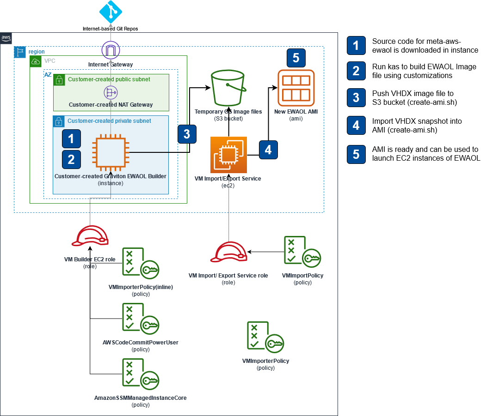

# The meta-aws-ewaol Repository

The **meta-aws-ewaol** asset provides the example code and instructions for building a customized Edge Workload Abstraction and Orchestration Layer (EWAOL) distribution in the form of an Amazon Machine Image (AMI).
The end result is a Yocto based AMI which can be a great help in testing your application in automotive envirnment as a virtual ECU. 

## How to Use

Source code: [GitHub ](https://github.com/aws4embeddedlinux/meta-aws-ewaol/tree/kirkstone)

