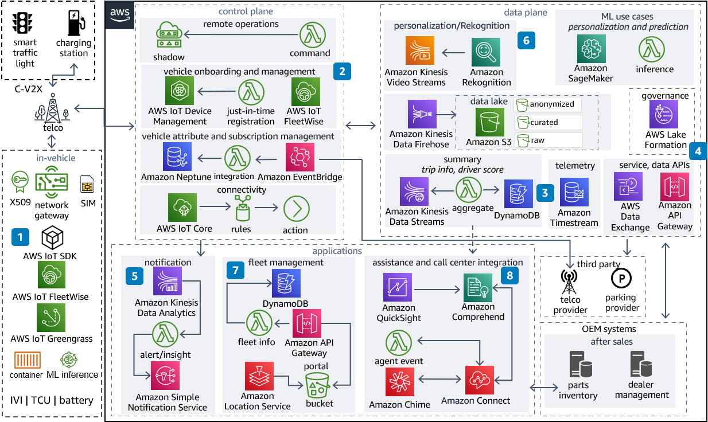

This reference architecture outlines the key components of a connected mobility platform, addressing three core elements: in-vehicle, external infrastructure, and backend services hosted in the cloud. The adoption of a serverless architecture is a pivotal strategy, significantly reducing operational overhead for the connected mobility platform.

**Connected Mobility Platform Diagram**

*Reference architecture diagram illustrating the utilization of AWS services within your connected mobility platform.*

To build this architecture, AWS IoT FleetWise Edge Agent and AWS IoT Core are used to facilitate bidirectional data communication with the cloud. AWS IoT Greengrass serves as the host for edge components and supports machine learning (ML) at the edge.

AWS IoT Device Management plays a critical role in onboarding vehicles and managing their lifecycles. It also enables remote operations through the AWS IoT Device Shadow service.

Raw telemetry data, along with selected values from Amazon Timestream, is stored in an Amazon Simple Storage Service (Amazon S3) bucket. Aggregated data is maintained in Amazon DynamoDB, and the entire data lake is governed by AWS Lake Formation.

For the exposure of service and data APIs, AWS Data Exchange and Amazon API Gateway are leveraged, catering to both internal and external requirements.

Real-time alert generation and insights are driven by Amazon Managed Service for Apache Flink.

The architecture supports the personalization of use cases through Amazon Rekognition and facilitates the development of custom models using Amazon SageMaker, particularly for preventive or predictive scenarios.

Additionally, a fleet management portal is established for fleet operators, enabling real-time monitoring of vehicles, with Amazon Location Service offering key geospatial capabilities.

Finally, the call center is empowered by Amazon Connect and Amazon Chime, while call insights can be visualized through Amazon QuickSight.

### Download The Editable Diagram

For complete customization of this reference architecture diagram, tailored to your business requirements, download the ZIP file that includes an editable PowerPoint [here](https://docs.aws.amazon.com/architecture-diagrams/latest/connected-mobility-platform-on-aws/samples/connected-mobility-platform-on-aws.zip)
