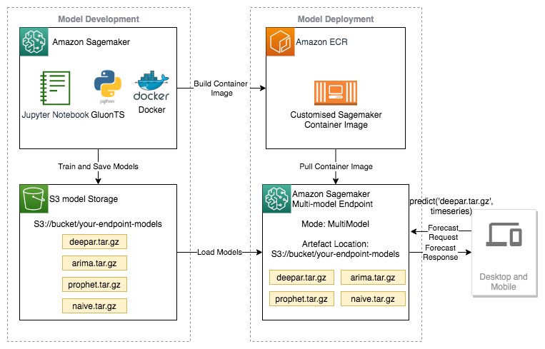

## Forecast electricity demand with GluonTS and SageMaker custom containers

Electricity demand prediction accelerator that helps in training and evaluating time series models with Gluon TS library and Amazon SageMaker custom containers. This accelerator uses the datasets from UC Irvine Machine Learning Repository - Individual household electric power consumption.

### AWS Services

    Amazon SageMaker
    AWS ECR
    Gluon TS

### Architecure

Click [here](https://github.com/aws-samples/amazon-sagemaker-predict-electricity-demand-with-custom-gluonts-container/tree/main) to access the library and start designing your solution.