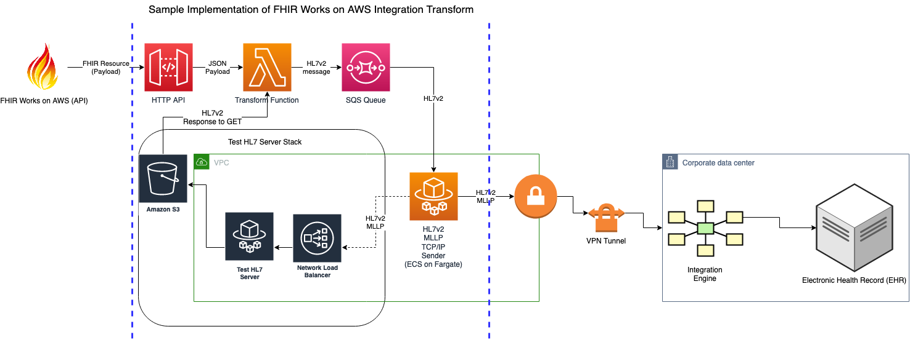

### Implementing FHIR works on aws using HL7V2 Transform
This AWS sample project demonstrates implementation of an Integration Transform designed to extend third-party integration capabilities of FHIR Works on AWS framework.

### Architecture
This sample architecture consists of multiple AWS serverless services. The endpoint is hosted using API Gateway backed by a Lambda function. We chose to use SQS to pass messages from transform function to Fargate container implementing HL7v2 client (sender).

We also implemented Test HL7 Server using NLB, Fargate, and S3.

In production environment, you would need to establish secure encrypted connection from your VPC to the network where your HL7 endpoint is hosted. For illustration purposes, we show encrypted connection from your VPC to your corporate data center using VPN tunnel. You should consult your account team for prescriptive guidance regarding establishing secure and reliable network connection between your on-premises network and VPC.

Click [here](https://github.com/aws-samples/fhir-hl7v2-integration-transform#fhir-works-on-aws-hl7v2-transform) to access the library and start designing your solution.