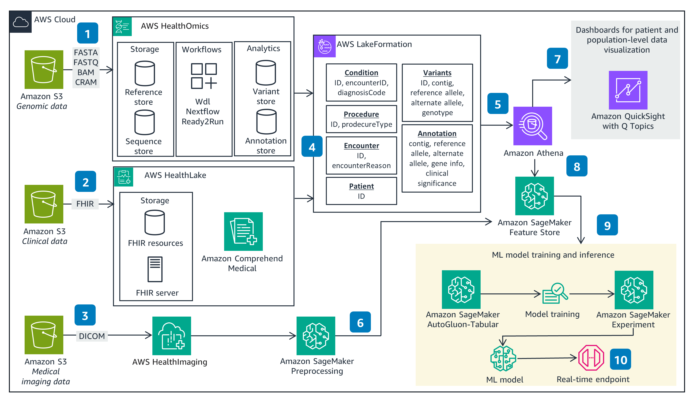

### Multi-Modal Data Analysis with AWS Health and ML Services
This Guidance demonstrates how to set up an end-to-end framework to analyze multimodal healthcare and life sciences (HCLS) data. It analyzes this data using purpose-built health care and life sciences services (such as AWS HealthOmics, AWS HealthLake, AWS HealthImaging) and machine learning (ML) and analytics services (such as Amazon SageMaker, Amazon Athena, and Amazon QuickSight). It ingests raw HCLS data formats like variant call format (VCF), Fast Healthcare Interoperability Resources (FHIR), and Digital Imaging and Communications in Medicine (DICOM), and provides a zero-extract, transform, load (ETL) architecture to customers who want to run their data analysis at scale on AWS.

### Architecture

The [Multi-Modal Data Analysis with AWS Health and ML Services](https://aws.amazon.com/solutions/guidance/multi-modal-data-analysis-with-aws-health-and-ml-services/?did=sl_card&trk=sl_card) provides guidance and demonstrates how to set up an end-to-end framework to analyze multimodal healthcare and life sciences (HCLS) data.