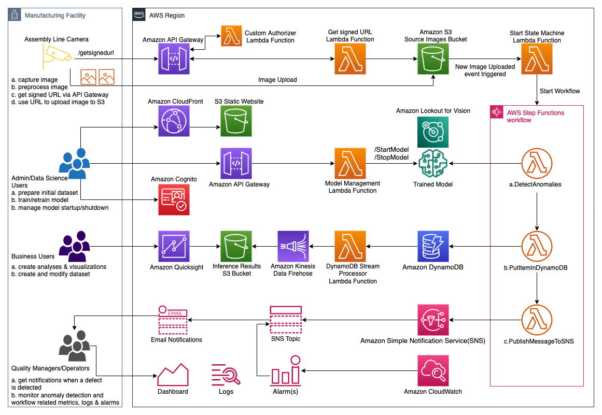

## Detect manufacturing defects in real time using Amazon Lookout for Vision

Amazon Lookout for Vision is a machine learning (ML) service that spots defects and anomalies in visual representations using computer vision (CV). With Amazon Lookout for Vision, manufacturing companies can increase quality and reduce operational costs by quickly identifying differences in images of objects at scale. For example, Amazon Lookout for Vision can be used to identify missing components in products, damage to vehicles or structures, irregularities in production lines, miniscule defects in silicon wafers, and other similar problems. Amazon Lookout for Vision uses ML to see and understand images from any camera as a person would, but with an even higher degree of accuracy and at a much larger scale. Amazon Lookout for Vision allows customers to eliminate the need for costly and inconsistent manual inspection, while improving quality control, defect and damage assessment, and compliance. In minutes, you can begin using Amazon Lookout for Vision to automate inspection of images and objects–with no machine learning expertise required.

### Features:

    Image upload to S3 using API Gateway and S3 signed URL
    Anomaly Detection using Amazon Lookout For Vision
    Inference results storage using Amazon DynamoDB
    Notifications using Amazon SNS
    Monitoring & Alerting using Amazon CloudWatch

### Architecure

Click [here](https://github.com/aws-samples/amazon-lookout-for-vision-serverless-app?search=1) to access the library and start designing your solution.