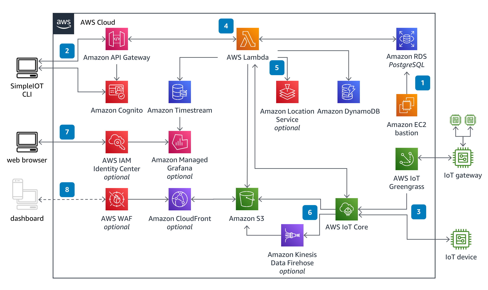

## Guidance for Connected Products with SimpleIOT on AWS

This Guidance helps you implement SimpleIOT, an intuitive system for creating cloud-connected Internet of Things (IoT) devices from the ground up. SimpleIOT helps you rapidly set up a fully functional serverless Internet of Things (IoT) framework in an AWS account. It supports rapid creation of complete, secure, connected devices that send and receive data to the cloud in near real-time.

### Architecure

Click [here](https://aws.amazon.com/solutions/guidance/connected-products-with-simpleiot-on-aws/) to access the library and start designing your solution.