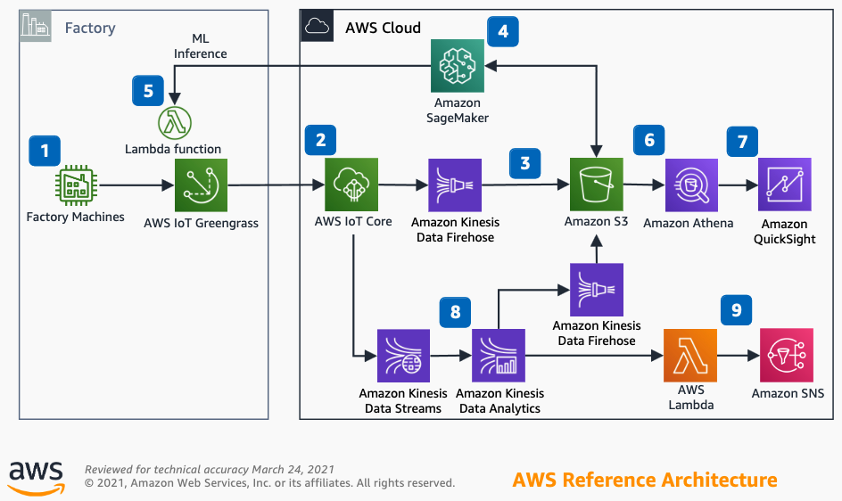

## Anomaly detection for industrial workloads

This reference architecture provides the design for creating a Predictive Maintenance (PdM) Machine Learning (ML) model using Amazon SageMaker with AWS IoT Core and an anomaly detection application using Amazon Kinesis Data Analytics.

### Architecure

1. Configure AWS IoT Greengrass using Greengrass Connectors to communicate with factory machines.

2. Configure rules within AWS IoT Core to trigger events based on MQTT topics for the factory machines.

3. Create an Amazon Kinesis Data Firehouse delivery stream to store the factory machines data in the data lake on Amazon Simple Storage Service (Amazon S3).

4. Build your Predictive Maintenance (PdM) Machine Learning (ML) model with Amazon SageMaker.

5. Deploy your Machine Learning model onto your AWS IoT Greengrass Edge Gateway.

6. Build your data queries in Amazon Athena against your AWS Glue Data Catalog of the data lake on Amazon S3.

7. Visualize your analysis using Amazon QuickSight on the Amazon Athena data source.

8. Create an anomaly detection application in Amazon Kinesis Data Analytics.

9. Configure AWS Lambda as an output of Amazon Kinesis Data Analytics application to send anomaly detections notifications to an Amazon Simple Notification Service (Amazon SNS) topic.
