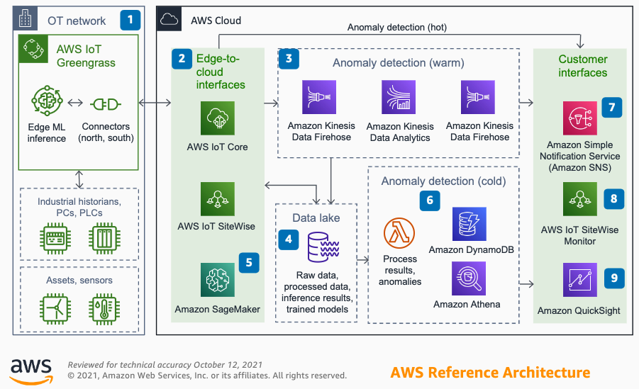

## Anomaly detection for industrial workloads

This reference architecture uses IoT, analytics, and machine learning services to design a solution that can inform operational technology teams of performance anomalies.

### Architecure

1. Telemetry from industrial assets is ingested by connectors in an AWS IoT Greengrass edge solution. Hot anomaly detection originates at the edge with stream analytics and machine learning inference.

2. Edge-to-cloud interfaces AWS IoT Core and AWS IoT SiteWise ingest telemetry. 

3. Amazon Kinesis Data Analytics runs queries to determine anomalistic behavior in datasets on the warm path.

4. An Amazon Simple Storage Service (S3) data lake architecture stores raw and processed device telemetry, trained machine learning (ML) models, and ML inference results.

5. ML models are trained and used for batch inference on the cold anomaly detection path with Amazon SageMaker, or any of the application-level AI services such as Amazon Lookout for Equipment.

6. Code running in AWS Lambda functions analyzes the results of batch inference produced by ML models. 

7. Operational technology teams consume alerts from SNS as emails, text messages, or integration into ticketing systems.

8. No-code dashboards assess real-time and historical machine performance.

9. Amazon QuickSight to evaluates history of anomalies, fleet performance, and other scaled analysis.