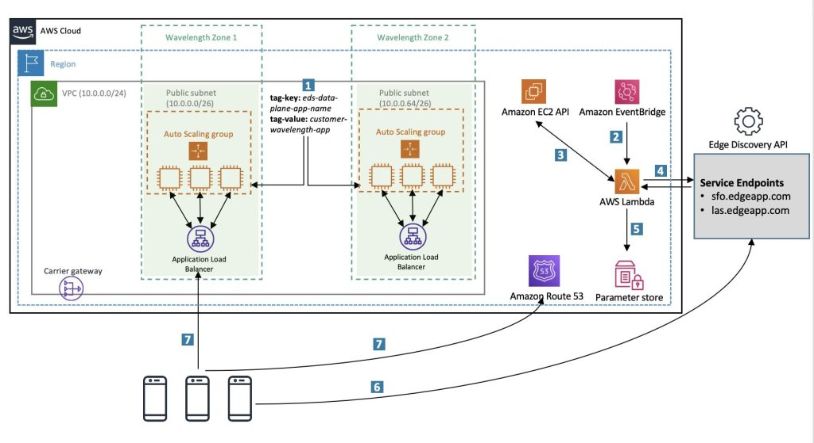

# Deploying dynamic 5G Edge Discovery architectures with AWS Wavelength

With the rapid expansion of AWS edge computing infrastructure, developers face new challenges in deploying applications to optimal locations and discovering the best endpoints to service requests based on factors like latency and network topology. Effective solutions involve geo-distributed, automated deployments across multiple zones and granular, accurate discovery methods beyond DNS that consider the requesting device's precise location within the network rather than just resolver IP.

To address this developer feedback, this asset (in the form of a blogpost) positions a reference pattern using Telecommunication provider-developed Edge Discovery Service (EDS) APIs and how they can be directly integrated into powerful event-driven architectures. As an example, this post demonstrates how to use the [Verizon Edge Discovery Service](https://www.verizon.com/business/5g-edge-portal/documentation/verizon-5g-edge-discovery-service/api-reference.html) to provide a dynamic workflow for mobile clients in highly distributed edge compute environments.

Access the blogpost [here](https://aws.amazon.com/blogs/industries/deploying-dynamic-5g-edge-discovery-architectures-with-aws-wavelength/)