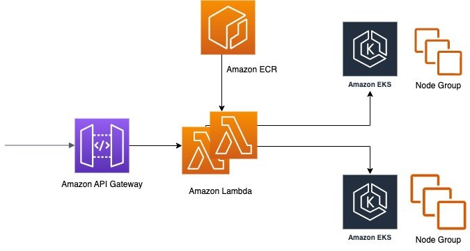

# Telco Workload Placement and Configuration Updates with Lambda and inotify

With users and applications demanding high bandwidth along with low latencies, mobile service providers and application developers are working hard to meet demanding performance requirements. To deliver high bandwidth with low latencies, operators often need to deploy mobile Container Network Functions (CNFs) to deliver network connectivity services closer to the traffic location. Since a CNF needs a Kubernetes cluster in which it is deployed, this results in having multiple Kubernetes clusters in a Communication Service Providers (CSP) network.

This asset shows one way to implement an agile workload placement method that provides a simple abstraction to business applications by using AWS container and serverless constructs. The use of serverless technologies for this task provides an inherent resiliency in this solution implementation. These constructs are flexible and can be adopted to meet CSPs and network function providers automation requirements. This approach is straightforward yet extendible.

Read the blogpost [here](https://aws.amazon.com/blogs/industries/telco-workload-placement-and-configuration-updates-with-lambda-and-inotify/) and then clone the associated repository [here](https://github.com/aws-samples/telco-workload-placement-via-lambda-inotify) to start leveraging this asset.