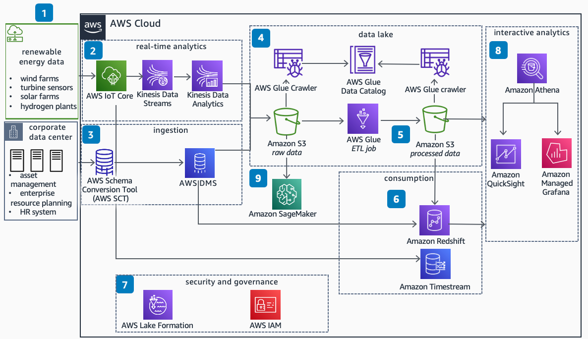

# Data Lake Architecture for Renewable Energy

This architecture enables you to build a renewable energy data lake that includes telemetry data from IoT devices, and business application data for near real-time monitoring. It also enables you to visualize data and make predictions with machine learning (ML) models.

##  Data Lake Architecture for Renewable Energy Diagram

1. Renewable energy data is ingested into **AWS IoT Core** with MQ Telemetry Transport (MQTT) protocol.

2. Using AWS IoT rules engine within **AWS IoT Core**, telemetry data is routed to **Amazon Timestream** and **Amazon Simple Storage Service (Amazon S3)** through **Amazon Kinesis Data Streams**. Use **Amazon Managed Service for Apache Flink** to transform and analyze streaming data in near real-time.

3. The schemas for the on-premise databases are discovered and converted by the **AWS Schema Conversion Tool (AWS SCT)**. The data is moved by **AWS Database Migration Service (AWS DMS)** to **Amazon S3** and **Amazon Redshift**.

4. Data stored in **Amazon S3** is crawled by **AWS Glue crawler**. The schemas are discovered and the **AWS Glue Data Catalog** is populated with this metadata.

5. **AWS Glue** extract, transform, load (ETL) jobs process, transform, and enrich the raw data, and output it in an **Amazon S3** processed bucket.

6. Schemas and tables are then created in **Amazon Redshift**. Using the COPY command, data is loaded into **Amazon Redshift** tables. Business logic data transformations can then be performed by stored procedures.

7. The **AWS Glue Data Catalog**, **AWS Lake Formation**, and **AWS Identity and Access Management (IAM)** are used to provide centralized security and governance.

8. **Amazon Athena**, **Amazon QuickSight**, and **Amazon Managed Grafana** visualize data and build dashboards and reporting.

9. Use raw datasets with **Amazon SageMaker** to train and deploy machine learning models.

