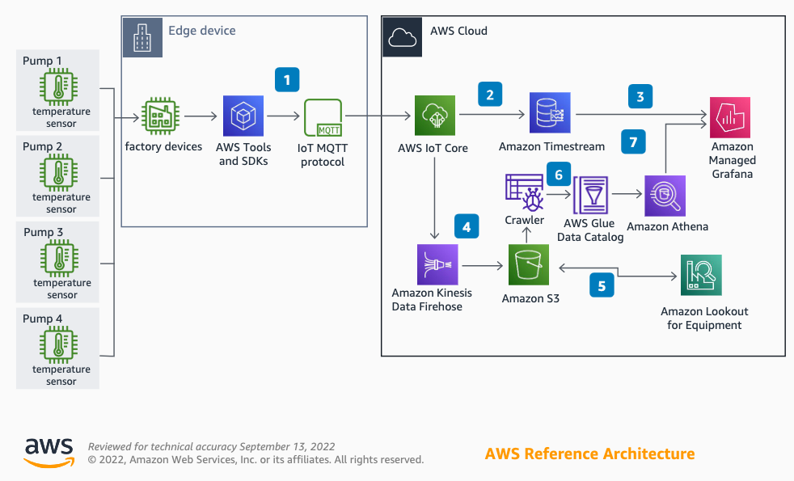

# Machine Learning Enabled Predictive Maintenance

Sucker rod pumping systems are the most widely applied artificial lift equipment in the oil and gas industry. Condition-
based maintenance with near real-time inference results and notifications are necessary for the best maintenance of
applications and equipment.

##  Predictive Maintenance Architecture Diagram

1. Use the MQTT protocol in an **AWS IoT device SDK** to ingest data to **AWS IoT Core** from sucker rod pumps.

2. Configure an IoT rule in **AWS IoT Core** to store data in **Amazon Timestream** as time series data.

3. Visualize and monitor sensor data by using **Amazon Managed Grafana** in a near real time interactive dashboard from an **Amazon Timestream** database.

4. Configure an IoT rule in **AWS IoT Core** to capture, transform, and deliver data to **Amazon Simple Storage Service** (Amazon S3) using **Amazon Kinesis Data Firehose**.

5. **Amazon Lookout for Equipment** analyzes data from **Amazon S3** and automatically trains a unique machine learning (ML) model to detect equipment abnormalities in near real-time without managing infrastructure. The inference results are stored in **Amazon S3**.

6. Use **AWS Glue Data Catalog** to categorize the data. The metadata catalog is integrated by **Amazon Athena** to perform one-time or on-demand queries on the data.

7. Display inference results from **Amazon Athena** by using **Amazon Managed Grafana**.