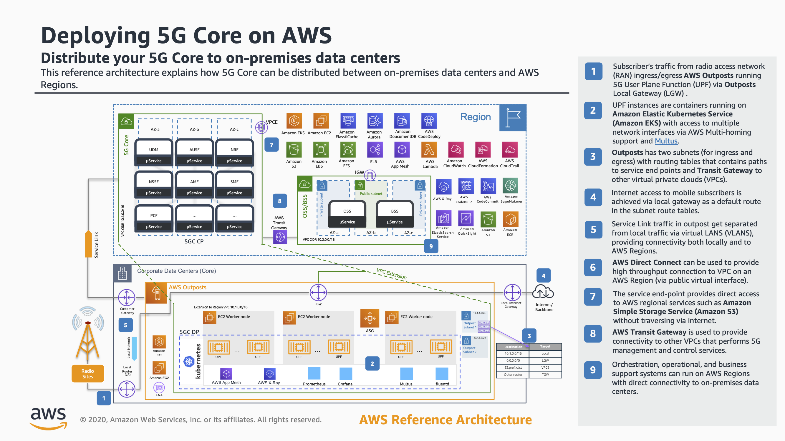

# Deploying 5G Core on AWS: Distribute your 5G Core to on-premises data centers

This reference architecture explains how 5G Core can be distributed between on-premises data centers and AWS Regions.

