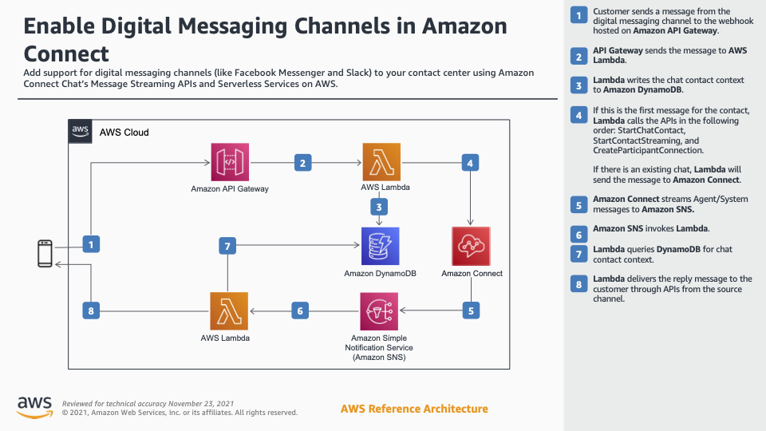

# Enable Digital Messaging Channels in Amazon Connect

Add support for digital messaging channels (like Facebook Messenger and Slack) to your contact center using Amazon Connect Chat’s Message Streaming APIs and Serverless Services on AWS.

