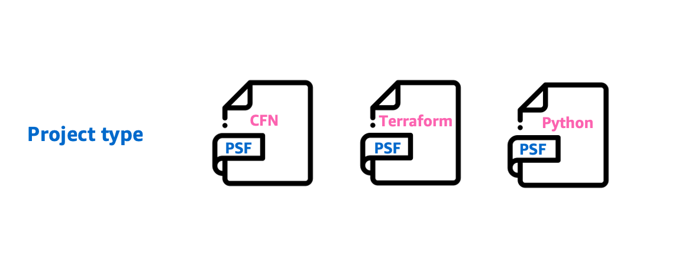
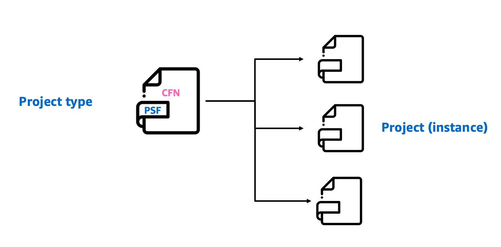
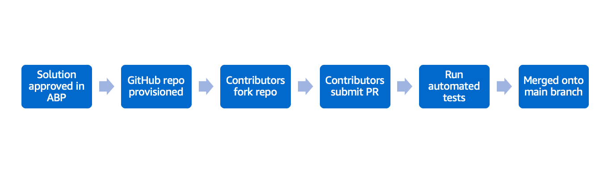
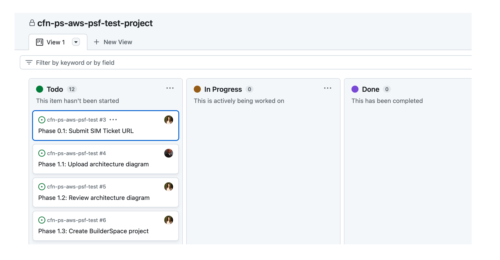

# AWS Builder Platform

The AWS Builder Platform is a self-service API and UI that provides code repositories with built-in automation for best practice and security validation. The Platform surfaces machine-driven feedback to the builder at each step of the process via a language agnostic, extensible code analysis framework. Tools and automated test ensure that security and coding standards are continuously maintained as the builder creates, iterates, and makes the asset available on AWS. ABP allows AWS teams and partner builders to collaborate in a context that is familiar and consistent to both. The self-service nature of the Builder Platforn ensures that Partners and AWS Tech Field Teams (SAs, TAMs, etc) can spend their time engaging on high-value activities such as architectural design rather than editing code and performing manual processes to move assets through the publication pipeline.

Tools and solutions managed via ABP are available in [this GitHub repo](https://github.com/aws-ia) but partners may build and manage solutions via ABP without publishing to a public repo.

## Key Concepts

### Project
A project is any solution that SBG supports partners in building.

### Project Type

A project type is a template and set of automated steps used for testing, provisioning, and publishing a particular category of projects (in the case of SBG, the category will be SBG plus the language family of the solution - CloudFormation, Terraform, Python, etc.)

### Projects vs. Project Types

> _A project type is analogous to a class, while a project is analogous to an instance of a class_

Each project type belongs to a language family - such as CFN, Terraform, Python - plus SBG-specific provisioning and testing definitions.

Because of this inheritance structure, an individual project instance will inherit all testing, provisioning, and publishing definitions contained in its parent project type - i.e., every time you create a project that belongs to a specific project type, those definitions will apply to your individual project instance. As a result, you don’t have to waste time manually writing the same tests for every single solution you build.

### Project Type Specification
The specification defines the criteria that must be met in order to consider a solution validated. SBG has standard definitions for testing, provisioning, and publication for all of its project types, but these may be modified for a given solution to accommodate the use case and objective. For example, a partner may customize the definitions for:

* **Static tests**: Simple data validations (e.g., if it’s a CloudFormation project, it might run a linter to validate syntax or check that the security groups are not open to public)
* **Functional tests**: Create resources in an AWS account to ensure the functionality of the solution.
* **Publication**: Successful validation of all automated tests defined in the project type. However, a 'published' solution is not necessarily publicly available; in some cases, solutions are  published to AWS Marketplace or Terraform Hashicorp Registry, while in other cases they will remain private.

## Proposing a solution
Partners can contact their designated Partner Development Manager or Partner Development Specialist to discuss and propose a SBG solution. The PDx will then submit the proposal to AWS Builder Platform.

Once the solution is approved, they will work with the SBG team on contributing to and tracking the solution.

### Contributing to a solution
Once the solution is approved in ABP:

1. I&A will automatically provision a GitHub repo
2. Contributors (partner builders and/or AWS builders) will fork and add their code to the forked repo
3. Builders will then submit a PR to merge it with the main branch
4. When they submit a PR, the automated tests are triggered
5. Once all tests pass and 2 reviewers approve the PR, it gets merged into the main branch

### Tracking a solution
Additionally, when a solution is approved in ABP, a template for solution tracking will be generated in GitHub. The template, called a [GitHub Project](https://docs.github.com/en/issues/planning-and-tracking-with-projects/learning-about-projects/about-projects) is attached to the GitHub repo created by ABP.

The Project contains a set of Issues, which you can see in the `Todo` column in the example below:

Issues represent steps in the SBG Build Hub and the Project aggregates all of those Issues. This allows everyone (no matter what point they become involved in the solution) to understand what activities are required to validate the solution and how much progress has been made thus far. In addition, all artifacts and resources are consolidated in the project's GitHub repo.
