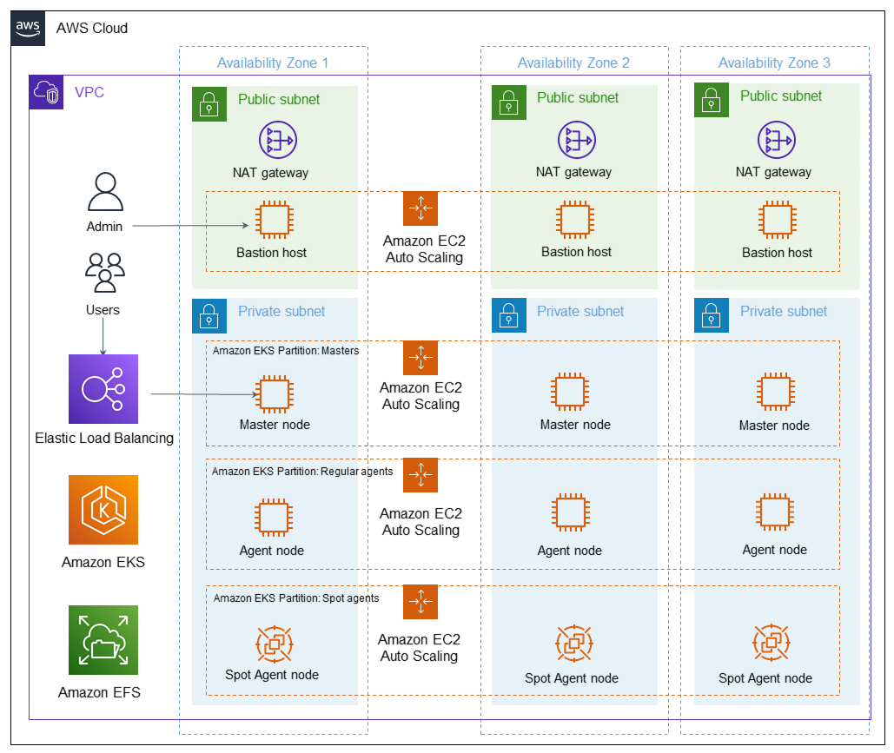

### Continous Integration using Cloudbees -  A CI solution based on Jenkins and integrated with Amazon EKS
This Partner Solution deploys CloudBees CI on the Amazon Web Services (AWS) Cloud to provide continuous integration (CI) that's based on Jenkins and integrated with Amazon Elastic Kubernetes Service (Amazon EKS).

The Partner Solution sets up a CI environment that meets architectural best practices, including high availability, automatic scaling, segregation of agent workloads, and Kubernetes-native integration with Amazon Elastic Compute Cloud (Amazon EC2) Spot Instances.

The Partner Solution is automated by AWS CloudFormation templates that deploy CloudBees CI in about 45 minutes in your AWS account. You can choose to install CloudBees CI into a new virtual private cloud (VPC) or into your existing VPC. After you deploy the Partner Solution, you can use Jenkins plugins to add functionality to your CI environment.

This reference deployment uses the Amazon EKS Architecture Partner Solution as a foundation to provide a fully managed, highly available, and certified Kubernetes-conformant control plane for CloudBees CI.

### Architecture

The [CloudBees CI on the AWS](https://aws.amazon.com/quickstart/architecture/cloudbees-ci/) allows you to build CI using Jenkins and Amazon EKS.
