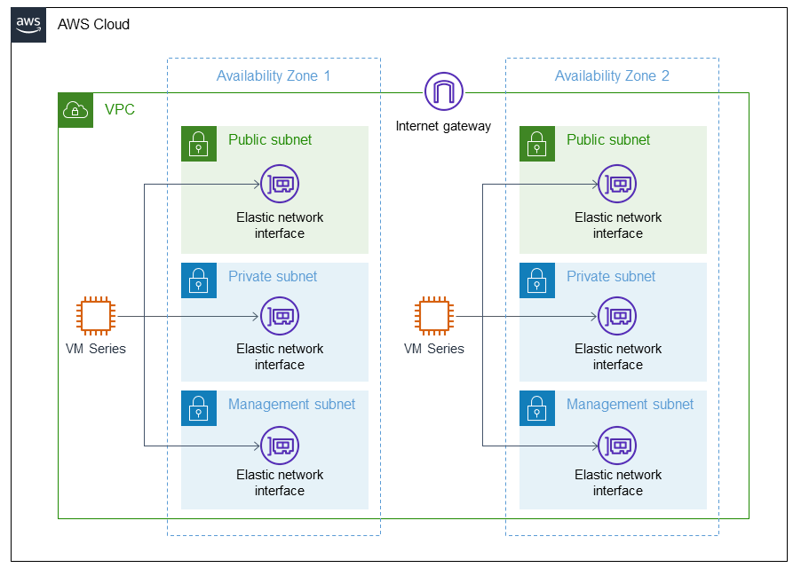

### Palo Alto Networks VM-Series on AWS  
This Terraform module deploys Palo Alto Networks VM-Series to the Amazon Web Services (AWS) Cloud.

### Architecture

The [Palo-Alto on AWS](https://aws.amazon.com/quickstart/terraform-modules/palo-alto-vm-series/) terraform allows you to deploy Palo Alto VM on AWS using Terraform template.