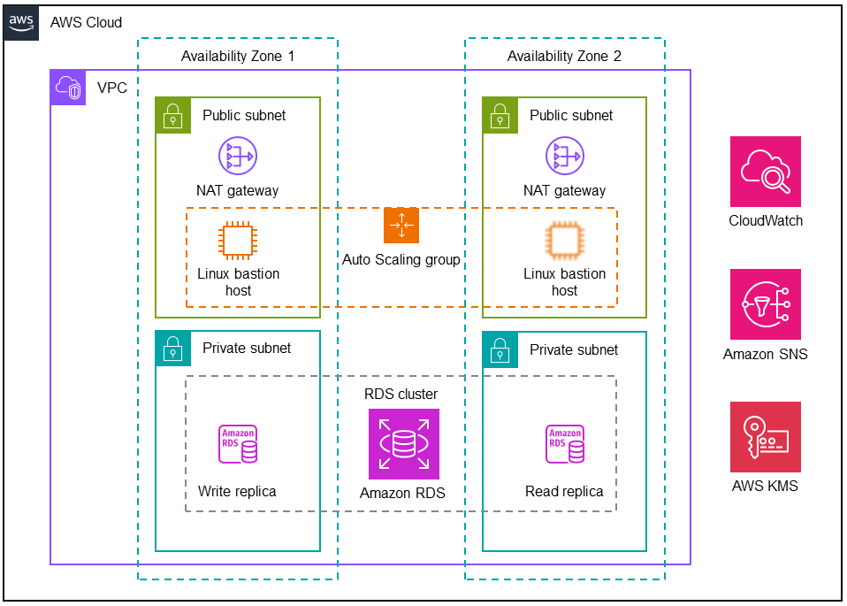

### Amazon RDS on AWS   
This solution deploys Amazon Relational Database Service (Amazon RDS) for PostgreSQL, MySQL, or Microsoft SQL Server in the Amazon Web Services (AWS) Cloud. The solution deploys an Amazon RDS cluster to a private subnet with an Amazon RDS read replica in one Availability Zone and a write replica in another zone. Native SQL Server replication mechanisms synchronize the read replica with the source database. The deployment also includes access to Amazon CloudWatch metrics and logs, event notifications, and data encryption.

### Architecture

The [Amazon RDS on AWS](https://aws.amazon.com/solutions/implementations/amazon-rds-postgresql/) allows you to Operate, manage, and scale your Amazon RDS databases in the cloud
