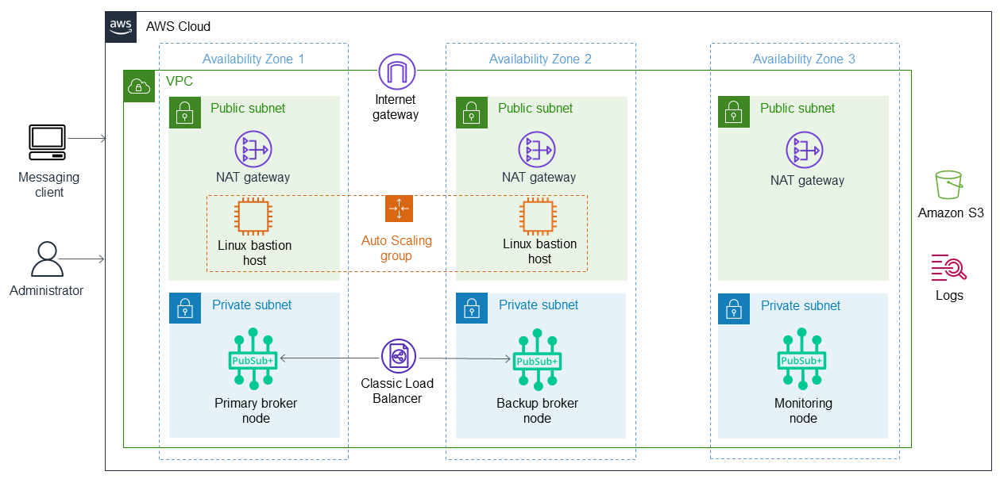

### Solace on AWS   
This Partner Solution deploys Solace PubSub+ to the Amazon Web Services (AWS) Cloud. Solace PubSub+ is a message broker that lets you establish event-driven interactions between applications and microservices regardless of location.

This Partner Solution uses AWS CloudFormation templates to deploy Solace PubSub+ message brokers in high availability (HA) redundancy groups for fault tolerance. You can use this Partner Solution to build a new virtual private cloud (VPC) or deploy Solace PubSub+ message brokers into your existing VPC.

### Architecture

The [Solace on AWS](https://aws.amazon.com/solutions/partners/solace-pubsub/) allows you to deploy this Partner Solution with default parameters builds the following PubSub+ event broker environment in the AWS Cloud.